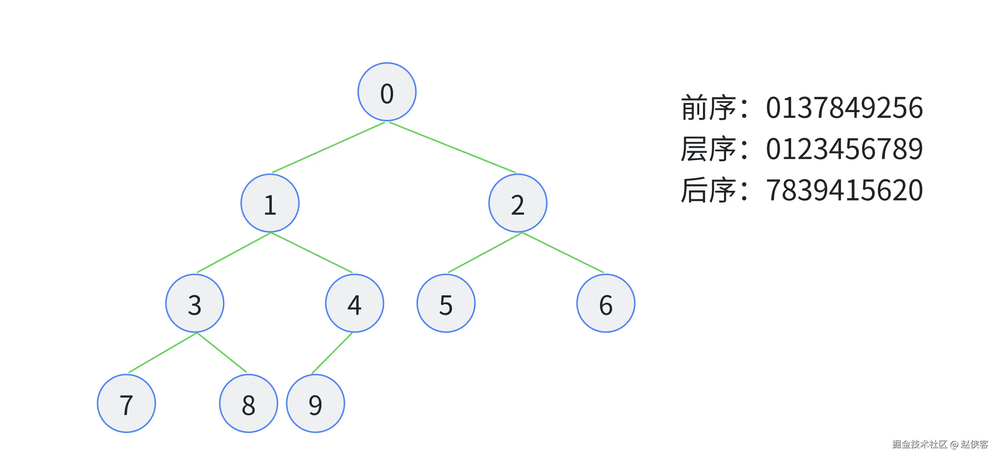

# Map Node Order

<br>

---

<br>

Give a Map such as like below:



<br>

implements 3 func:

code: 

```go
package main

type TreeNode struct {
	id       string
	subNodes *[]TreeNode
}

func preOrder(root *TreeNode) string {
    return nil
}

func postOrder(root *TreeNode) string {
    return nil
}

func levelOrder(root *TreeNode) string {
    return nil
}

func main() {
    // demo tree
    node9 := TreeNode{id: "9"}
    node8 := TreeNode{id: "8"}
    node7 := TreeNode{id: "7"}
    node6 := TreeNode{id: "6"}
    node5 := TreeNode{id: "5"}
    node4 := TreeNode{id: "4", subNodes: &[]TreeNode{node9}}
    node3 := TreeNode{id: "3", subNodes: &[]TreeNode{node7, node8}}
    node2 := TreeNode{id: "2", subNodes: &[]TreeNode{node5, node6}}
    node1 := TreeNode{id: "1", subNodes: &[]TreeNode{node3, node4}}
    node0 := TreeNode{id: "0", subNodes: &[]TreeNode{node1, node2}}

    pre := preOrder(&node0)
    post := postOrder(&node0)
    level := levelOrder(&node0)

    fmt.Println("pre: ", pre)
    fmt.Println("post: ", post)
    fmt.Println("level: ", level)
}
```

<br>

expect:
```
pre:  0137849256
post:  7839415620
level:  0123456789
```

