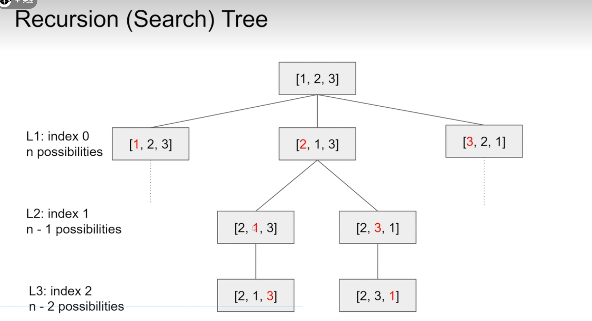
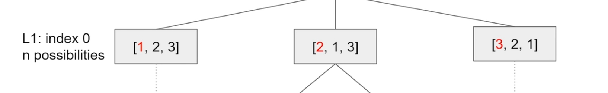
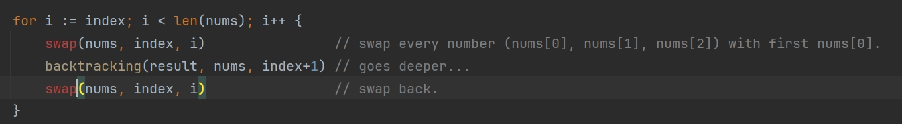
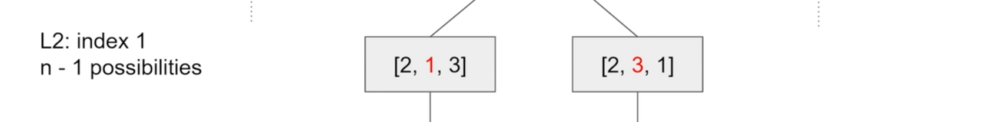
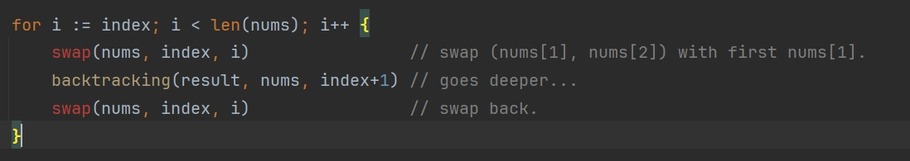
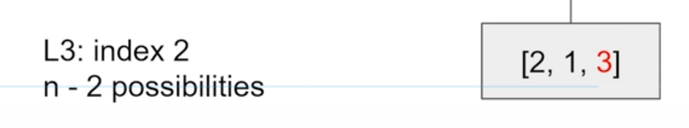
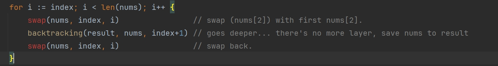

# [1, 2, 3] Permutation

 

---

 

Everyone knows that the permutations of [1, 2, 3] have 6 sets (3! = 6 = 3 * 2 * 1). But how to get all permutations is a problem.

The Backtrack (DFS) Algorithm is suitable for solving this problem.

Let's try it!

 

In the case of [1, 2, 3], the recursion will have 3 layers.

In the first layer, swap each number with the first index, resulting in 3 sets.

In the second layer, swap each number with the second index except for the first number, resulting in 2 sets.

In the third layer, swap each number with the third one, resulting in only 1 set.

If there are no more layers (there will only be 1 set), store the numbers into the answers.

 

 

## Point

First, look at the first layer:

and code will be:

you can see the code just follow the role, swap: nums[index=0] with first nums[0].
then goes deeper (next layer), and swap back, do next swap: nums[index=0] with first nums[1], goes deeper
and swap back, then do next swap: nums[index=0] with first nums[2] goes deeper then swap back.

 
 

in second layer will be like:

 

code:

 
 

in third layer will be like:

code:

 
 

If you're trying to trace the changes to nums during the loop operation, you're going to get overwhelmed. 
I think the best way to understand backtracking is to be aware of what it does at each layer (swap, go deeper, then swap back).