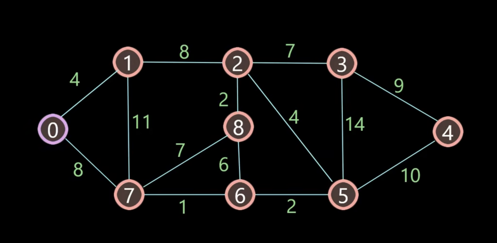
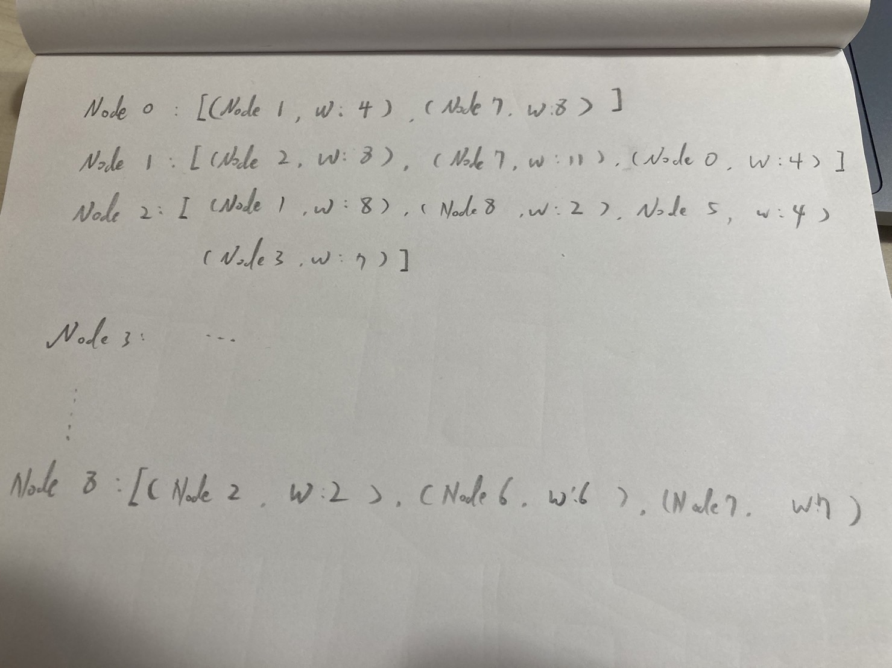
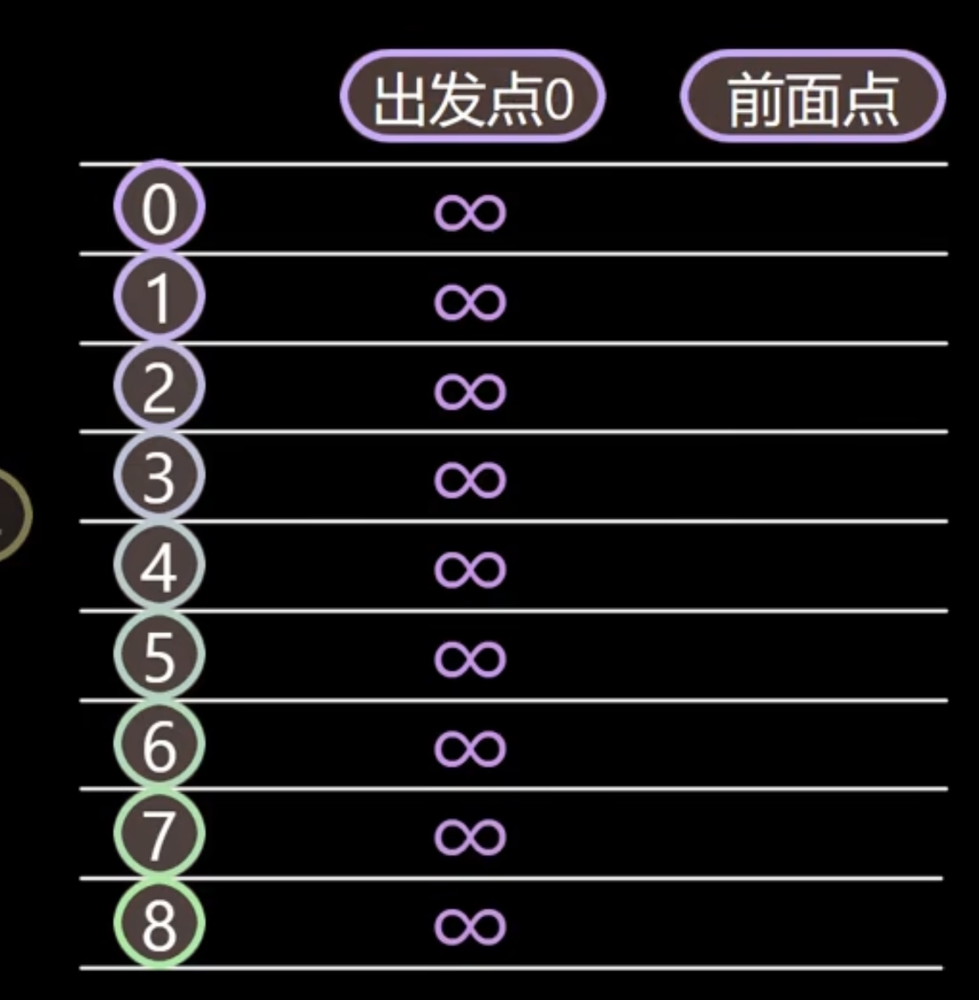

# Algorithm of the shortest route between two subway stations (Taipei MRT)

<br>

---

<br>

## MRT image:


<br>
<br>

## Topic

* Dijkstra 
  * [算法】最短路径查找—Dijkstra算法](https://www.bilibili.com/video/BV1zz4y1m7Nq/)
  * [[演算法] 學習筆記 — 14. Dijkstra Algorithm 最短路徑演算法](https://medium.com/@amber.fragments/%E6%BC%94%E7%AE%97%E6%B3%95-%E5%AD%B8%E7%BF%92%E7%AD%86%E8%A8%98-14-dijkstra-algorithm-%E6%9C%80%E7%9F%AD%E8%B7%AF%E5%BE%91%E6%BC%94%E7%AE%97%E6%B3%95-745983dd4332)

<br>

## Thinking

Dijkstra is way more difficult to most leetcode problem that I have been done.
And I think I can't not just start with a Taipei MRT station map, maybe I will go with a 
smaller map like:



<br>

According to the tutorial, first of all I have to make a Map like this:



```jsunicoderegexp
key: node number
value: List<Neighbor Node and Distance>
```

<br>

So, let finish it by ChatGPT. lol

<br>

```go
package taipei_mrt

var Graph = map[int][]Edge{
	0: {{1, 4}, {7, 8}},
	1: {{0, 4}, {2, 8}, {7, 11}},
	2: {{1, 8}, {3, 7}, {5, 4}, {8, 2}},
	3: {{2, 7}, {4, 9}, {5, 14}},
	4: {{3, 9}, {5, 10}},
	5: {{2, 4}, {3, 14}, {4, 10}, {6, 2}},
	6: {{5, 2}, {7, 1}, {8, 6}},
	7: {{0, 8}, {1, 11}, {6, 1}, {8, 7}},
	8: {{2, 2}, {6, 6}, {7, 7}},
}

type Edge struct {
	node, weight int
}
```

<br>

What's the next? 

Following the instruction, I made a PriorityQueue in go, I'm a little bit confuse about
how golang work with that queue? I mean I didn't implement any interface or extends any class,
but It seems like PriorityQueue are implements sort and heap interface.

and I asked ChatGPT, I got the answer by following content:

```jsunicoderegexp
In Go, interfaces are implemented implicitly. This means that a type doesn't need to explicitly declare that it implements an interface; instead, 
if a type provides the methods that an interface requires, it implicitly satisfies that interface. This is different from languages like Java or C#,
 where you have to explicitly state that a class implements an interface.

In the case of the priority queue, Go's container/heap package expects any type that implements the heap.Interface to provide certain methods. 
Let's look at how this works in the context of your PriorityQueue.

heap.Interface
The heap.Interface in Go's container/heap package requires a type to implement the following methods:

Len() int: returns the number of elements in the collection.
Less(i, j int) bool: reports whether the element with index i should sort before the element with index j.
Swap(i, j int): swaps the elements with indexes i and j.
Push(x interface{}): adds an element x to the collection.
Pop() interface{}: removes and returns the minimum element (according to Less).
Your PriorityQueue type implements all these methods.
```

<br>

For now, I recognized PriorityQueue is a Queue, whatever pop or push their all going to add or remove a Item from the end of the item list.

ChatGPT said I was wrong:

```jsunicoderegexp
Priority Queue as a Min-Heap
A priority queue allows elements to be added in any order, but when removing elements, the one with the highest priority (smallest value) is always removed first. The container/heap package in Go provides a heap implementation, which can be used to implement a priority queue efficiently.

Operations
Push:

When you push an item into the PriorityQueue, it is added to the end of the underlying slice.
The heap property is then restored, which might involve moving the new item up in the heap to its correct position.
Pop:

When you pop an item from the PriorityQueue, the item with the smallest priority is removed.
This item is typically the root of the heap (the first item in the slice).
The last item in the slice is moved to the root position, and the heap property is restored by moving this item down to its correct position.
Example
Here's a visual example of how the Push and Pop operations maintain the heap property:

Initial State
makefile
Copy code
PriorityQueue: []
Push Item {node: 0, priority: 10}
yaml
Copy code
PriorityQueue: [{node: 0, priority: 10}]
Push Item {node: 1, priority: 5}
yaml
Copy code
PriorityQueue: [{node: 1, priority: 5}, {node: 0, priority: 10}]
Push Item {node: 2, priority: 8}
yaml
Copy code
PriorityQueue: [{node: 1, priority: 5}, {node: 0, priority: 10}, {node: 2, priority: 8}]
Pop (removes item with smallest priority)
yaml
Copy code
PriorityQueue: [{node: 2, priority: 8}, {node: 0, priority: 10}]
Detailed Code Analysis
Here's how the Push and Pop methods work in the context of the priority queue:

go
Copy code
func (pq *PriorityQueue) Push(x interface{}) {
	n := len(*pq)
	item := x.(Item)
	item.index = n
	*pq = append(*pq, item)
	heap.Fix(pq, item.index) // Ensure the heap property is maintained
}

func (pq *PriorityQueue) Pop() interface{} {
	old := *pq
	n := len(old)
	item := old[n-1]
	old[n-1] = Item{} // Avoid memory leak
	*pq = old[0 : n-1]
	if n > 1 {
		heap.Fix(pq, 0) // Ensure the heap property is maintained
	}
	return item
}
Explanation
Push:

Adds the new item to the end of the slice.
Calls heap.Fix to move the new item up to its correct position in the heap, ensuring the smallest priority item is at the root.
Pop:

Removes the item at the end of the slice, which is the root of the heap (smallest priority item).
Moves the last item in the slice to the root position.
Calls heap.Fix to move this item down to its correct position, ensuring the smallest priority item is at the root.
Summary
In a priority queue implemented as a min-heap:

Push adds an item and restores the heap property by moving the item up.
Pop removes the smallest priority item and restores the heap property by moving an item down.
The key is that the heap property ensures that the smallest priority item is always at the root, allowing for efficient retrieval and removal of the highest-priority item.
```

<br>

Now I figure out what is the PriorityQueue. and let's keep on doing:

Next, I gonna implements this:


Other step I comment in code.

Amazing!!!