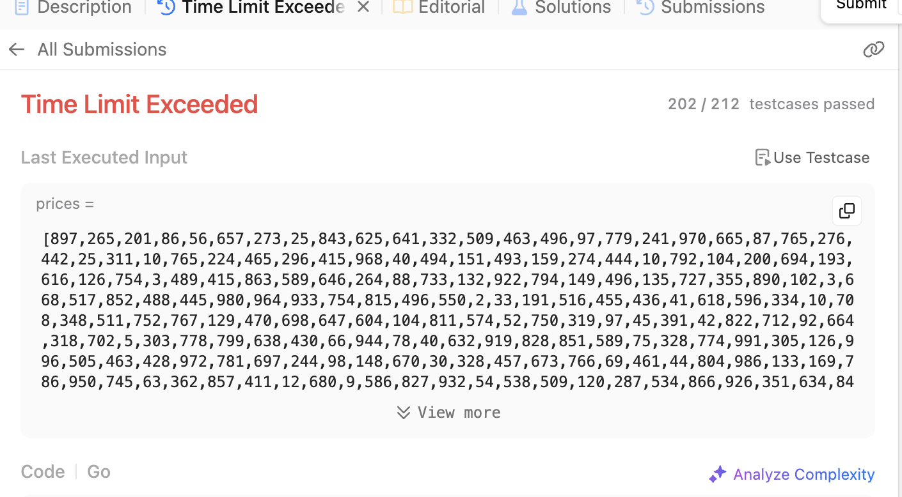
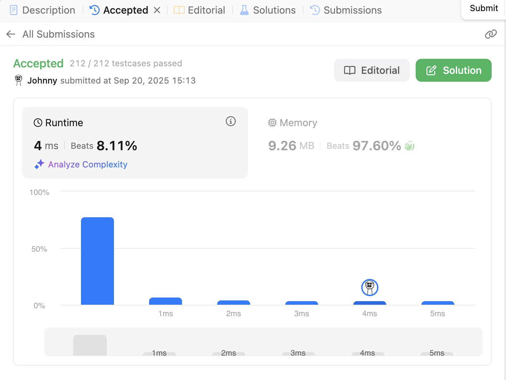
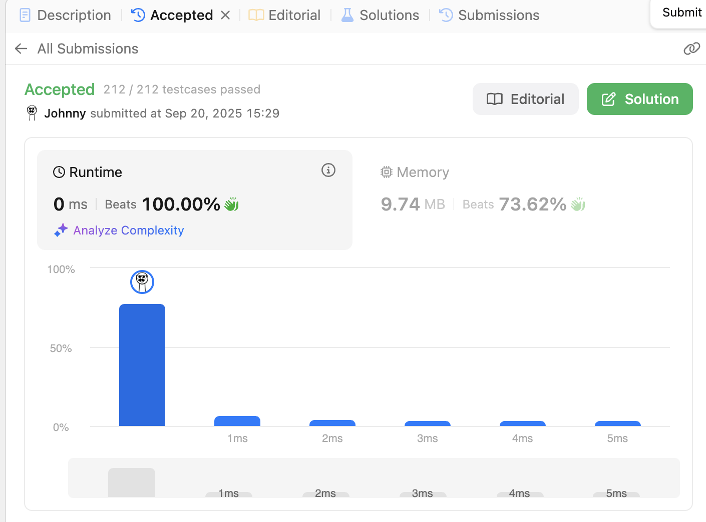

# 121. Best Time to Buy and Sell Stock

<br>

---

<br>


link: https://leetcode.com/problems/best-time-to-buy-and-sell-stock/description/

<br>
<br>

## Thinking

First of all, let's do it with a stupid way, just iterate through the input.

<br>
<br>

## Coding-1

```go

func maxProfit(prices []int) int {
	if len(prices) == 1 {
		return 0
	}

	bestPnl := 0

	for i := 0; i < len(prices); i++ {
		for j := i + 1; j < len(prices); j++ {
			pnl := prices[j] - prices[i]
			if pnl > bestPnl {
				bestPnl = pnl
			}
		}
	}

	return bestPnl
}
```

<br>



<br>

Of course it's a time limit exceeded.

<br>
<br>

## Refine

let's check out the hint:

* Array
* DP, state transform.

<br>

I love DP approach, first of all, let's define the DP array, as I know the DP array always store the result.

I'd like to say, using 1 1D array:

```go
[]int -> index: index Day, value: min entry price before index Day.
```

and also I need a max pnl as temp value.

let's try this out:


## Coding-2

```go
func maxProfit(prices []int) int {
	maxPnl := 0

	dp := make([]int, len(prices))
	dp[0] = prices[0] // min entry price

	for i := 1; i < len(prices); i++ {

		price := prices[i]
		if price < dp[i-1] { // have better entry price
			dp[i] = price // update best entry price
		} else {
			dp[i] = dp[i-1] // keep the current best entry price
			maxPnl = max(maxPnl, price-dp[i]) // calculate best pnl
		}
	}

	return maxPnl
}
```

result:



<br>

## Refine

Now I tried DP, but I guess I'm not on the right track with defined wrong dp array.

I think I'm already did my best, just using 1 loop struct to solve this problem.

Now I need some hint.

<br>

### Claude AI:

* Current Analysis:

    You're storing the minimum price seen so far at each position in dp[i]. However, notice that you only ever reference dp[i-1] - you never need to look back further than the previous element. This is a classic sign that you can optimize space complexity.

<br>

* The Key Insight:

  Since you only need the "minimum price seen so far" (not the entire history), you can maintain this as a single variable that gets updated as you iterate.

<br>

Seems like I don't have to using DP to solve this problem. let do revamp:

<br>
<br>

## Coding-3

<br>

```go
func maxProfit(prices []int) int {
	maxPnl := 0
	minEntryPrice := prices[0]

	for i := 1; i < len(prices); i++ {

		price := prices[i]
		if price < minEntryPrice { // have better entry price
			minEntryPrice = price // update best entry price
		} else {
			maxPnl = max(maxPnl, price-minEntryPrice) // calculate best pnl
		}
	}

	return maxPnl
}
```

<br>



<br>

damn it! that's a trap!

DP is a trap lmao...