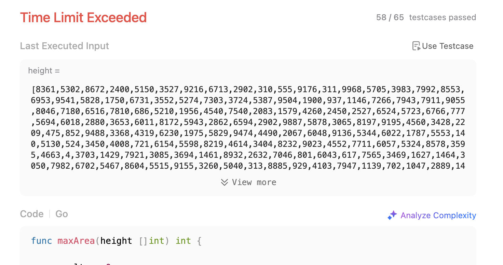
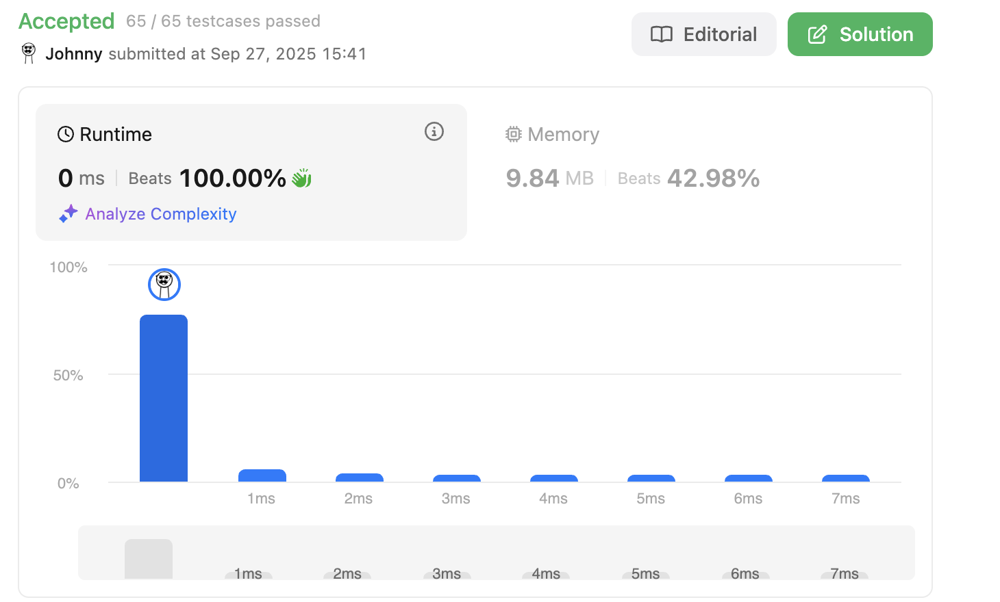

# Container With Most Water

<br>

---

<br>

link: https://leetcode.com/problems/container-with-most-water/description/

<br>
<br>

## Thinking

<br>

I'm thinking about using 2 pointer, and 2 loop.

* Outer `i` iterate through the input height as pointerA.
* Inner `j` iterate through the input height from last element (backward), when `i == j` just break.

Using those 2 pointer to calculate the max container.

I think this will be worked, let's try this out.

<br>
<br>

## Coding-1

```go
func maxArea(height []int) int {
	result := 0
	
	for i := 0; i < len(height); i++ {
		for j := i + 1; j < len(height); j++ {
			actHeight := min(height[i], height[j])
			actWidth := j - i
			prod := actWidth * actHeight
			result = max(result, prod)
		}
	}

	return result
}
```

<br>

result:



<br>

I'm not confuse about that, it should be time limit exceeded. I did it in a stupid way.

Let me think it over again...

<br>
<br>

## Revamp

<br>

I think it should be done in 1 loop. 

So, if we make 2 pointers iterate from both side of input array, shrink inward.
Each time move the smaller one forward.

Let's try it out.


## Coding-2

```go
func maxArea(height []int) int {
	result := 0

	pointerA := 0
	pointerB := len(height) - 1

	for pointerA < pointerB {
		heightA := height[pointerA]
		heightB := height[pointerB]

		temp := min(heightA, heightB) * (pointerB - pointerA)
		result = max(result, temp)

		if heightA == heightB {
			pointerA++
			pointerB--
		} else if heightA > heightB {
			// we need a bigger B, try moving B
			pointerB--
		} else {
			// we need a bigger A, try moving A
			pointerA++
		}
	}

	return result
}
```

<br>



<br>

Yeah, I'm on the right track.