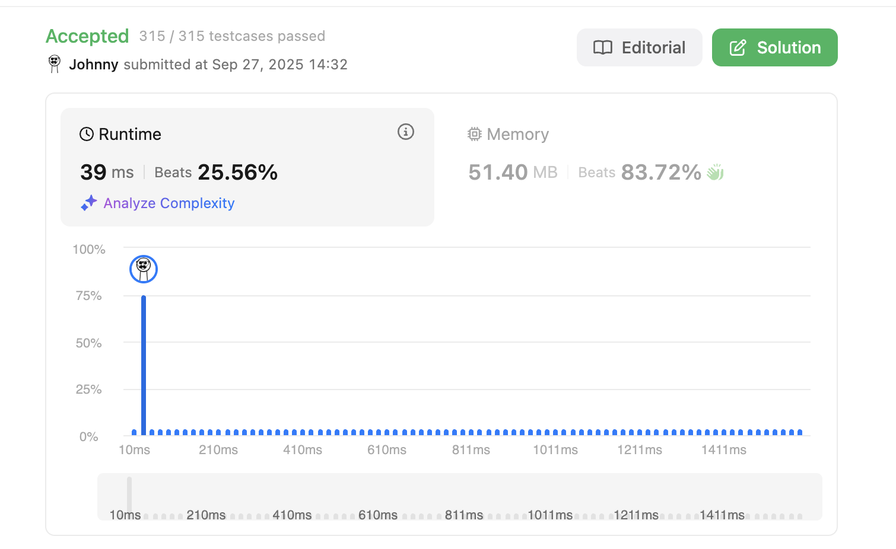
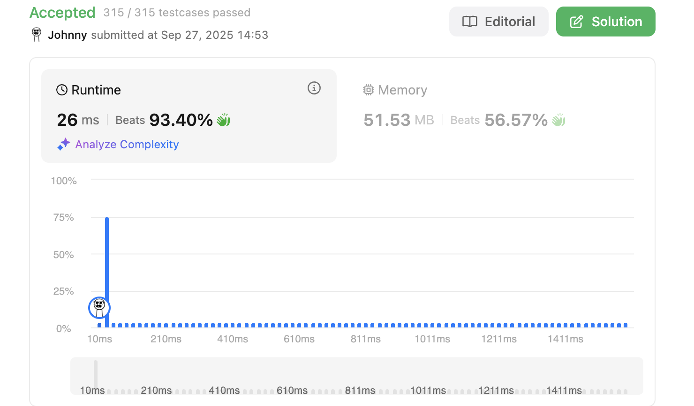

# 15. 3 Sum

<br>

---

<br>

link: https://leetcode.com/problems/3sum/

<br>

## Thinking

The topic is 2 pointer, I need to figure out how to utilize 2 pointer to solve this problem.

I'm just thinking about, using 2 nest for loop.

* outside loop, iterate through the input nums, as int `i`;
* inside loop, using 2 pointer iterate from `i` to the end...

It's not a good idea.

<br>

If I sorting at first, then I can get a asc ordered nums like:

```
nums = [-4, -1, -1, 0, 1, 2]
```

I have no idea, I need some hint.

<br>
<br>

## Claude AI

### Key insights:

1. After sorting, for each first element nums[i], you're looking for two other elements that sum to -nums[i]
2. Use two pointers starting from i+1 and n-1, move them based on the current sum
3. Skip duplicates - this is crucial for avoiding duplicate triplets

Edge cases to handle:

- When nums[i] > 0, you can break early (why?)
- Skip duplicate values for the first element
- Skip duplicate values when moving the two pointers

Movement logic:

- If current_sum < target: move which pointer?
- If current_sum > target: move which pointer?
- If current_sum == target: record result, then move both pointers and skip duplicates


<br>
<br>

## Coding-1

I did a first version like:

```java
    public List<List<Integer>> kycPoi(int[] nums) {
        // 1. sorting
        sort(nums);

        List<List<Integer>> result = new ArrayList<>();

        for (int i = 0; i < nums.length; i++) {

            int currentNum = nums[i];
            int targetSum = -currentNum;
            // need to find two sum = targetSum

            int pointerA = i + 1;
            int pointerB = nums.length - 1;

            // A -> <- B
            while (pointerA < pointerB) {
                int valA = nums[pointerA];
                int valB = nums[pointerB];
                int currentSum = valA + valB;

                if (currentSum == targetSum) {
                    // finded.
                    result.add(List.of(currentNum, valA, valB));
                    pointerA++;
                    pointerB--;
                }

                if (currentSum > targetSum) {
                    // means we need a smaller sum, move B to left
                    pointerB--;
                }

                if (currentSum < targetSum) {
                    // means we need a larger sum, move A to right
                    pointerA++;
                }
            }
        }
        return result;
    }
```

<br>

and test result:

```
Expected :[[-1, -1, 2], [-1, 0, 1]]
Actual   :[[-1, -1, 2], [-1, 0, 1], [-1, 0, 1]]
```

I need to solve the duplicate problem:

<br>

```java
class Solution {
    public List<List<Integer>> threeSum(int[] nums) {
        sort(nums);
        List<List<Integer>> results = new ArrayList<>();

        for (int i = 0; i < nums.length; i++) {
            if (i > 0 && nums[i] == nums[i - 1]) {
                // skip duplicates
                continue;
            }

            int targetSum = -nums[i];
            // 2 pointers
            int pointerA = i + 1;
            int pointerB = nums.length - 1;

            while (pointerA < pointerB) {

                int currentA = nums[pointerA];
                int currentB = nums[pointerB];
                int currentSum = currentA + currentB;
                
                if (currentSum == targetSum) {
                    results.add(List.of(nums[i], nums[pointerA], nums[pointerB]));

                    do {
                        pointerA++;
                    }while (pointerA < pointerB && nums[pointerA] == nums[pointerA - 1]);

                    do {
                        pointerB--;
                    } while (pointerB > pointerA && nums[pointerB] == nums[pointerB + 1]);

                } else if (currentSum < targetSum) {
                    // which is means we need a larger sum, move pointerA to right
                    do {
                        pointerA++;
                    }while (pointerA < pointerB && nums[pointerA] == nums[pointerA - 1]);
                } else {
                    // which is means we need a smaller sum, move pointerB to left
                    do {
                        pointerB--;
                    } while (pointerB > pointerA && nums[pointerB] == nums[pointerB + 1]);
                }
            }
        }
        return results;
    }
}
```

result:



<br>

I feel like it's kinda stupid. there must be a better way to revamp this.

Let's try to ask for help.

### Claude AI

* Redundant Duplicate Skipping:

  * Your duplicate skipping logic is more complex than needed. You're skipping duplicates in all three cases, but you only need to skip them when you find a valid triplet:

* Early Termination Optimization:
  
  * You can add an early break when the smallest possible sum is too large:
    ```java
    for (int i = 0; i < nums.length - 2; i++) {  // -2 because we need at least 3 elements
        if (nums[i] > 0) break;  // If smallest number is positive, no solution possible
        
        if (i > 0 && nums[i] == nums[i - 1]) continue;
        // ... rest of your logic
    }
    ```
    
<br>
<br>

## Coding-2

```java
import static java.util.Arrays.sort;

class Solution {
    public List<List<Integer>> threeSum(int[] nums) {
        sort(nums);
        List<List<Integer>> results = new ArrayList<>();

        for (int i = 0; i < nums.length - 2; i++) { // why (i < nums.length - 2) -> we need at least 3 numbers to form a triplet.
            if (nums[i] > 0) {
                break; // since array is sorted, no need to continue if the current number is > 0.
            }
            if (i > 0 && nums[i] == nums[i - 1]) {
                // skip duplicates
                continue;
            }

            int targetSum = -nums[i];
            // 2 pointers
            int pointerA = i + 1;
            int pointerB = nums.length - 1;

            while (pointerA < pointerB) {

                int currentA = nums[pointerA];
                int currentB = nums[pointerB];
                int currentSum = currentA + currentB;

                if (currentSum == targetSum) {
                    results.add(List.of(nums[i], nums[pointerA], nums[pointerB]));
                    do {
                        pointerA++;
                    }while (pointerA < pointerB && nums[pointerA] == nums[pointerA - 1]);
                    do {
                        pointerB--;
                    } while (pointerB > pointerA && nums[pointerB] == nums[pointerB + 1]);
                } else if (currentSum < targetSum) {
                    // which is means we need a larger sum, move pointerA to right
                        pointerA++;
                } else {
                    // which is means we need a smaller sum, move pointerB to left
                        pointerB--;
                }
            }
        }
        return results;
    }
}
```

result:

