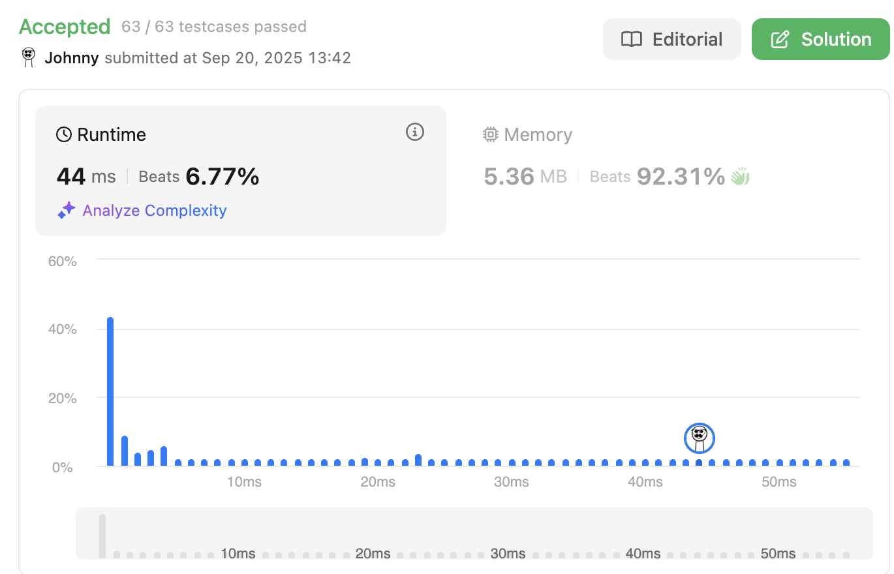

# Two Sum

<br>

---

<br>

link: https://leetcode.com/problems/two-sum/description/

<br>
<br>

## Thinking

I did that before, let me recap this...

I remember I used 2 pointer, let's try it out.


<br>

## Coding-1

```go
func twoSum(nums []int, target int) []int {
	// 2 <= nums.length <= 104
	pointerA := 0
	pointerB := 1
	totalLen := len(nums)

	for pointerA < totalLen-1 {

		if nums[pointerA]+nums[pointerB] == target {
			return []int{pointerA, pointerB}
		}

		pointerB++
		if pointerB == totalLen {
			pointerA++
			pointerB = pointerA + 1
		}

	}

	return []int{0, 1}
}
```

<br>



<br>

That's pretty sux... let's refine this.

<br>

## Refine

<br>

I checked the topic, `Array` and `HashTable`, no 2 pointer hint, so I guess it's not about using 2 pointer.
let's focus on `HashTable`.

Using hash-table to boost up search speed.

What if I pre-calculate all the diff (nums[i] - target) and put em into mapm like:

`Key: diff, Val: index`

<br>

## Coding-2

```go
func twoSum(nums []int, target int) []int {
	diffMap := map[int]int{}
    
	// build diff dict
	for idx, num := range nums {
		diffMap[target-num] = idx
	}

	// find.
	for idxA, num := range nums {
		if idxB, exists := diffMap[num]; exists && idxA != idxB {
			return []int{idxA, idxB}
		}
	}

	return nil
}
```


