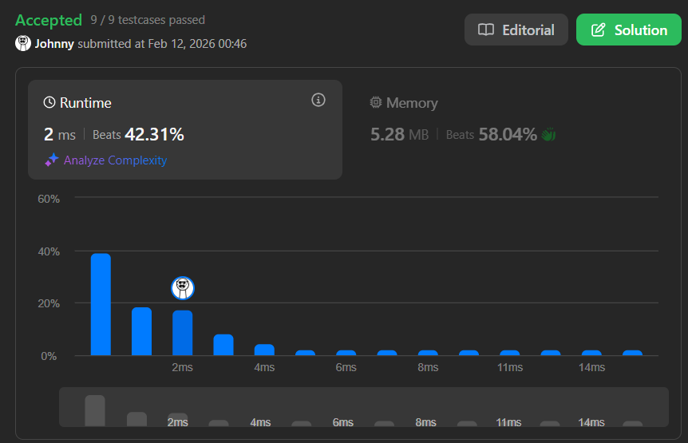

# 51. N-Queens

<br>

---

<br>

link: https://leetcode.com/problems/n-queens/description/

<br>

The n-queens puzzle is the problem of placing `n` queens on an `n x n` chessboard such that no two queens attack each other.

<br>

Given an integer `n`, return all distinct solutions to the n-queens puzzle. You may return the answer in any order.

Each solution contains a distinct board configuration of the n-queens' placement, where 'Q' and '.' both indicate a queen and an empty space, respectively.

<br>


Example: 

```
Input: n = 4
Output: [
    [
        ".Q..",
        "...Q", 
        "Q...",
        "..Q."
    ],
    [
        "..Q.",
        "Q...", 
        "...Q",
        ".Q.."
    ]
]
```

Explanation: There exist two distinct solutions to the 4-queens puzzle as shown above


<br>
<br>

## Thinking

<br>

### How does Queen attack?

The Queen in chess can attack eight direction

* Horizontal (left, right)
* Vertical (up, down)
* 4 diagonals (top left, top right, down left, down right) ↗ ↘ ↙ ↖ 

<br>

### First Shot

define `currentState` is chess board

I think this time I gonna need a `isSafeZone(currentState, x, y)` func, which can tell us is `currentState(x, y)` is in safeZone that can let us place a queen on it.


define backtracking()


```
backtracking(..., x, y): 
    return when n queens already placed.
    
    for i := x; i < n; i++:
        for j := y; h < n; n++:
            
            if !isSafeZone(currentState, i, j): 
                continue
            
            update currentState(i, j)
            backtracking(..., i, j+1)
            undo currentState(i, j)
```

<br>
<br>

### Thinking Enhancement

A queen attacks an entire row. So **we can't place two queens on the same row?**

There is `n` queens and `n` rows, which is means **one queen goes on each row**

<br>

#### One Queen Goes On Each Row

* Each recursive call handles one row
* Within that call, you only loop over columns to decide where to place the queen in that row
* Then recurse to the next row

<br>
<br>

#### Virtual Code

```
backtracking():
	if row == n -> safe currentState as one of the result

    for col := 0; col < n; col++: // iterate column
         if !isSafeZone(currentState, row, col): 
                continue
                
         update currentState with (row. col)
         goes to next row -> backtracking(..., currentState, row+1)
         undo currentState with (row. col)
```

#### How to represent `currentState`?

I think currentState could be an 2D array [][]string

<br>

#### `isSafeZone()` implement

Actually we don't care about rows, because each row should put 1 queen on it in every backtracking process.

So we should only care about horizontal safety and diagonal, anti-diagonal.

Here's a fun fact in 2D array, take a `4×4` board. 

<br>

Let's compute `row - col` for every cell:

```
          col0  col1  col2  col3
row 0:      0    -1    -2    -3
row 1:      1     0    -1    -2
row 2:      2     1     0    -1
row 3:      3     2     1     0
```

Cells with the same `row - col` value sit on the same `\` diagonal. For example, (0,0), (1,1), (2,2), (3,3) all have `row - col = 0`.


<br>

Now compute `row + col`:

```
          col0  col1  col2  col3
row 0:      0     1     2     3
row 1:      1     2     3     4
row 2:      2     3     4     5
row 3:      3     4     5     6
```

Cells with the same `row + col` value sit on the same `/` anti-diagonal. For example, (0,2), (1,1), (2,0) all have `row + col = 2`.

<br>

#### Why?

Think about moving along a `\` diagonal — you go `row+1, col+1` each step. 

So `row - col` stays constant.

Moving along a `/` anti-diagonal — you go `row+1, col-1` each step. So `row + col` stays constant.

<br>

#### back to the problem, how to implement `isSafeZone()`

We need 3 `map[int]bool` 1 for diagonal check, 1 for anti-diagonal check, and last one for columns check.

<br>
<br>

## Coding

```go
type NQueensContext struct {
	vertical     map[int]bool
	diagonal     map[int]bool
	antiDiagonal map[int]bool

	currentState [][]bool
	result       [][]string
	n            int
}

func (c *NQueensContext) collectCurrentState2Result() {
	collected := make([]string, c.n)

	for i := 0; i < c.n; i++ {

		buf := make([]uint8, c.n)
		for j := 0; j < c.n; j++ {
			if c.currentState[i][j] {
				buf[j] = 'Q'
			} else {
				buf[j] = '.'
			}
		}

		collected[i] = string(buf)
	}

	c.result = append(c.result, collected)
}

func (c *NQueensContext) tryPutQueen(row, col int) bool {
	// do safe zone check
	if c.vertical[col] || c.diagonal[row-col] || c.antiDiagonal[row+col] {
		return false // col already taken
	}
	// mark taken
	c.vertical[col] = true
	c.diagonal[row-col] = true
	c.antiDiagonal[row+col] = true
	// update state
	c.currentState[row][col] = true

	return true
}

func (c *NQueensContext) undo(row, col int) {
	// update state
	c.currentState[row][col] = false
	// mark taken
	c.vertical[col] = false
	c.diagonal[row-col] = false
	c.antiDiagonal[row+col] = false
}

func NewNQueensContext(n int) *NQueensContext {
	currentState := make([][]bool, n)
	for i := range n {
		currentState[i] = make([]bool, n)
	}

	return &NQueensContext{
		vertical:     make(map[int]bool),
		diagonal:     make(map[int]bool),
		antiDiagonal: make(map[int]bool),
		currentState: currentState,
		result:       make([][]string, 0),
		n:            n,
	}
}

func solveNQueens(n int) [][]string {
	// init current state
	checker := NewNQueensContext(n)
	backtracking(checker, 0)
	return checker.result
}

func backtracking(context *NQueensContext, row int) {
	if row == context.n {
		// collect currentState to result
		context.collectCurrentState2Result()
		return
	}

	for col := 0; col < context.n; col++ {
		if ok := context.tryPutQueen(row, col); ok {
			// go deeper
			backtracking(context, row+1)
			// undo state
			context.undo(row, col)
		}
	}
}
```

<br>

Result:

