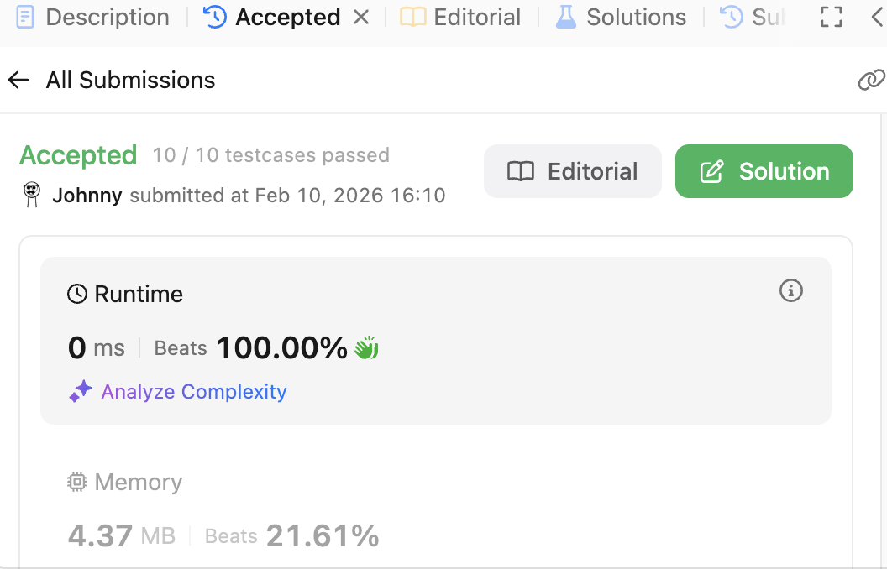

# 78. Subsets

<br>

---

<br>

link: https://leetcode.com/problems/subsets/description/

<br>

Given an integer array nums of unique elements, return all possible subsets (the power set).

The solution set must not contain duplicate subsets. Return the solution in any order.

<br>

Example 1:

```
Input: nums = [1,2,3]
Output: [[],[1],[2],[1,2],[3],[1,3],[2,3],[1,2,3]]
```

Example 2:

```
Input: nums = [0]
Output: [[],[0]]
```

<br>
<br>

---

<br>

## Thinking

Since it is backtracking training, so I want just think about using backtracking directly.

### The Key Question: What Decision Are We Making at Each Step?

> hen building a subset, at each element, what choices do we have?

Take `[1,2,3]` as an example. If I'm standing at element 1, what can I decide?

<br>

### Thinking Framework: **The Decision Tree**

Backtracking is essentially exploring a decision tree. Let me guide you to discover its structure:

Question 1: If we process elements left-to-right, and at each element we decide "include it or not", what does the tree look like for [1,2]?

```
                    []
                   /  \
            include 1?  
               /        \
             [1]         []
            /   \       /   \
      include 2?     include 2?
         /   \         /    \
      [1,2]  [1]     [2]    []
```

Question 2: Where are our "answers" in this tree? (leaves? every node? specific nodes?)


<br>

### The Backtracking Template Structure

Once you see the tree, backtracking follows a pattern:

```
function backtrack(current_state, remaining_choices):
    // 1. Base case: when to stop/collect result?
    
    // 2. For each choice available:
        // a. Make the choice (modify state)
        // b. Recurse with new state
        // c. Undo the choice (backtrack!)
```

<br>


<br>

### Ask yourself 4 problems

1. What represents our "current state"? (what are we building?)
2. What represents "remaining choices"? (what haven't we decided yet?)
3. When do we record a valid subset?
4. What does "undo the choice" mean concretely here?

<br>

* Answer-1: `currentState` I think it could be 1 of the result array `[]int`
* Answer-2: `remainingChoices` the elements left in nums that we didn't put into `currentState`
* Answer-3: record a valid subset when no `remainingChoices` left (record every leaf nodes).
* Answer-4: restores state so we can explore a different branch (`currentState = currentState[:len(currentState)-1]`).
---

<br>

## Coding - Binary decision

Pattern:

```go
func backtrack(index):
    if index == len(nums):
        record result       // only leaves are answers
        return
    
    choose nums[index]      // include this element
    backtrack(index + 1)
    unchoose
    
    backtrack(index + 1)    // exclude this element (no choose/unchoose needed)
```

<br>

Implements:

```go
func subsets(nums []int) [][]int {
	// build backtracking structure.
	// what do we need? resultCollection, currentState, remainChoices, undoAction
	resultCollection := make([][]int, 0)
	currentState := make([]int, 0)
	backtracking(&resultCollection, currentState, nums, 0)
	return resultCollection
}

// nums + idx = remainChoices
func backtracking(resultCollection *[][]int, currentState []int, nums []int, idx int) {
	if idx == len(nums) {
		// reach the end, store currentState as result.
		tmp := make([]int, len(currentState))
		copy(tmp, currentState)
		*resultCollection = append(*resultCollection, tmp)
		return
	}

	currentState = append(currentState, nums[idx])            // update currentState
	backtracking(resultCollection, currentState, nums, idx+1) // deep dive into next decision level
	currentState = currentState[:len(currentState)-1]         // undo currentState
	backtracking(resultCollection, currentState, nums, idx+1) // deep dive with other decision
}
```

<br>
<br>

## Coding - Loop-based 

Pattern:

```go
func backtrack(index):
    record result           // every node is answer
    for i := index to end:
        choose nums[i]      // update state
        backtrack(i + 1)    // go deeper
        unchoose            // undo state
```

Implements:

```go
func subsets(nums []int) [][]int {
	// build backtracking structure.
	// what do we need? resultCollection, currentState, remainChoices, undoAction
	resultCollection := make([][]int, 0)
	backtrackingA(&resultCollection, []int{}, nums, 0)
	return resultCollection
}

func backtrackingA(result *[][]int, currentState []int, nums []int, idx int) {
	// 1. record currentState as result
	tmp := make([]int, len(currentState))
	copy(tmp, currentState)
	*result = append(*result, tmp)

	// 2. for loop
	for i := idx; i < len(nums); i++ {
		// 3. update currentState
		currentState = append(currentState, nums[i])
		// 4. deep diving
		backtrackingA(result, currentState, nums, i+1)
		// 5. undo state
		currentState = currentState[:len(currentState)-1]
	}
}
```

<br>

Result:



<br>
<br>

---

<br>

## Important - Backtracking Pattern


###  Loop-based

```go
func backtrack(index):
    record result           // every node is answer
    for i := index to end:
        choose nums[i]      // update state
        backtrack(i + 1)    // go deeper
        unchoose            // undo state
```

<br>

### Binary decision

```go
func backtrack(index):
    if index == len(nums):
        record result       // only leaves are answers
        return
    
    choose nums[index]      // include this element
    backtrack(index + 1)
    unchoose
    
    backtrack(index + 1)    // exclude this element (no choose/unchoose needed)
```
