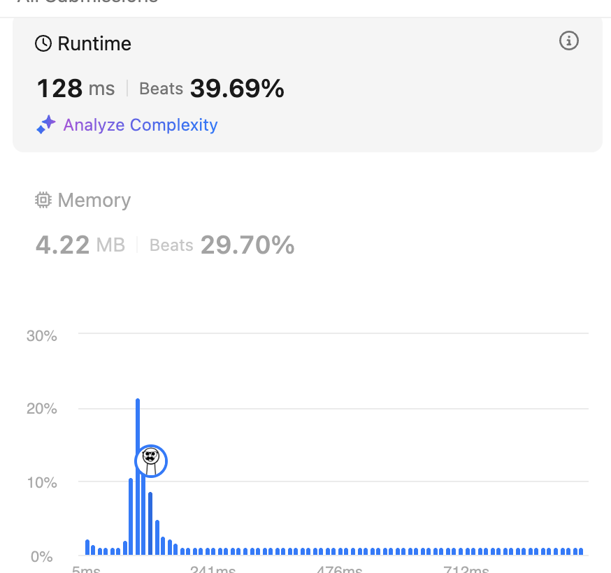

# 79. Word Search

<br>

---

<br>

link: https://leetcode.com/problems/word-search/

<br>

Given an `m x n` grid of characters board and a string word, return true if word exists in the grid.

The word can be constructed from letters of sequentially adjacent cells,
where adjacent cells are horizontally or vertically neighboring.

The same letter cell may not be used more than once.

<br>
<br>

## Thinking - Backtracking

When it comes to backtracking, I always think about decision tree.

When I iterate to a new letter here is 2 options:

Does this cell match word[matchIndex]?

* Yes → explore 4 directions deeper
* No → return false (backtrack automatically)

backtracking return: 
* return true when `matchIndex == len(word)`
* return false if can't match word's index in current (row, col).

We also need a `[][]bool` to mark which position already visited.


<br>

## Coding - Backtracking

```go
func exist(board [][]byte, word string) bool {
	visited := make([][]bool, len(board))
	for i := range len(board) {
		visited[i] = make([]bool, len(board[i]))
	}

	for row := 0; row < len(board); row++ {
		for col := 0; col < len(board[row]); col++ {
			if dfs(board, word, row, col, 0, visited) {
				return true
			}
		}
	}

	return false
}

func dfs(board [][]byte, word string, row, col, wordIdx int, visited [][]bool) bool {
	if wordIdx == len(word) {
		return true
	}

	if row < 0 || row >= len(board) || col < 0 || col >= len(board[row]) {
		// DFS explore out of range
		return false
	}

	// already visited
	if visited[row][col] {
		return false
	}

	// word index not matched
	if board[row][col] != word[wordIdx] {
		return false
	}

	// mark visited
	visited[row][col] = true
	r1 := dfs(board, word, row-1, col, wordIdx+1, visited) // up
	r2 := dfs(board, word, row+1, col, wordIdx+1, visited) // down
	r3 := dfs(board, word, row, col+1, wordIdx+1, visited) // right
	r4 := dfs(board, word, row, col-1, wordIdx+1, visited) // left

	visited[row][col] = false

	return r1 || r2 || r3 || r4
}
```

<br>

Result:



<br>
<br>