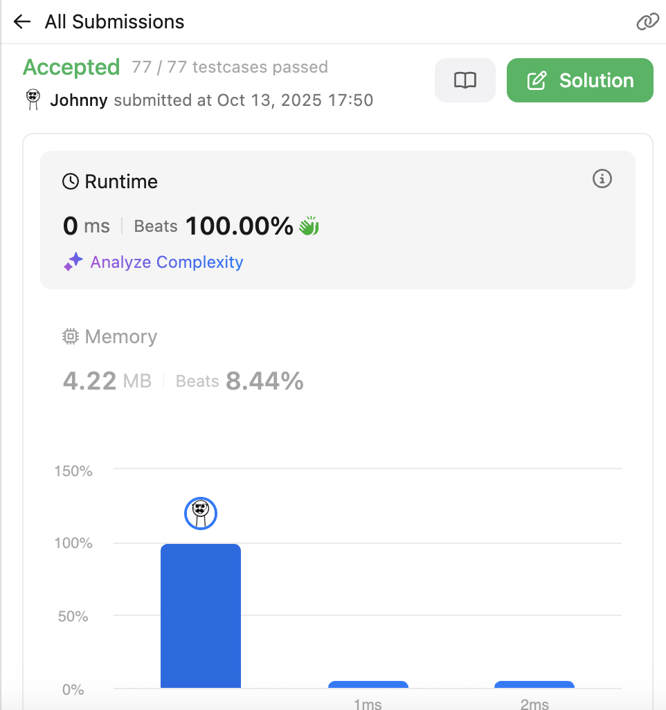

# 226. Invert Binary Tree

<br>

---

<br>

link: https://leetcode.com/problems/invert-binary-tree/description/

<br>

## Thinking

**Topic**

* DFS
* BFS

<br>
<br>

## Coding

```go
func invertTree(root *TreeNode) *TreeNode {
	if root == nil {
		return root
	}
	perform(root)
	return root
}

func perform(root *TreeNode) {
	if root == nil {
		return
	}

	leftNode := root.Left
	rightNode := root.Right

	root.Left = rightNode
	root.Right = leftNode

	perform(leftNode)
	perform(rightNode)
}
```

<br>

## Result



<br>
<br>

## Revamp

start swap from the bottom.

```go
func perform(root *TreeNode) {
	if root == nil {
		return
	}

	perform(root.Left)
	perform(root.Right)

	root.Left, root.Right = root.Right, root.Left
}
```