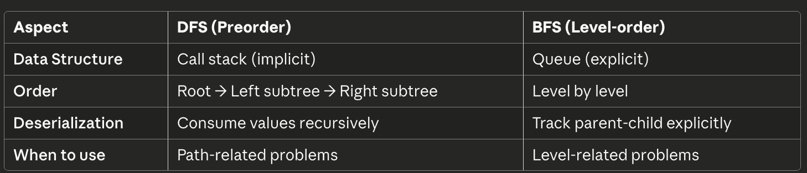

# 297. Serialize and Deserialize

<br>

---

<br>

link: https://leetcode.com/problems/serialize-and-deserialize-binary-tree/description/

<br>

> Serialization is the process of converting a data structure or object into a sequence of bits so that it can be stored in a file or memory buffer, or transmitted across a network connection link to be reconstructed later in the same or another computer environment.

> Design an algorithm to serialize and deserialize a binary tree. There is no restriction on how your serialization/deserialization algorithm should work. You just need to ensure that a binary tree can be serialized to a string and this string can be deserialized to the original tree structure.

> Clarification: The input/output format is the same as how LeetCode serializes a binary tree. You do not necessarily need to follow this format, so please be creative and come up with different approaches yourself.

<br>

Constraints:

* The number of nodes in the tree is in the range [0, 104].
* -1000 <= Node.val <= 1000

<br>


## Thinking

I saw many example by previous tree problems, there always show me the example by an Array like:

```go
[3, 5, 1, null, null, 7, 11]
```

I'm thinking about should I use this data structure to serialize tree?

<br>
<br>

## Claude AI Suggests

There are 2 solution to implement tree serialize and deserialize

* Preorder (DFS) with null markers
* Level-order (BFS)

<br>

### Preorder (DFS) with null markers

```
     1
   /   \
  2     3
   \   /
    4 5

→ "1,2,null,4,null,null,3,5,null,null,null"
```

**Pros:** Simpler to implement recursively, natural for DFS
**Cons:** More nulls stored, looks longer

* Recursive thinking with implicit state (call stack)
* How tree structure maps to linear sequences
* The elegant symmetry between serialize/deserialize

Core skill: Understanding how recursion "automatically" handles tree traversal

<br>
<br>

### Level-order (BFS)

```
     1
   /   \
  2     3
   \   /
    4 5

→ [1, 2, 3, null, 4, 5]
```

**Pros:** Compact, intuitive visualization
**Cons:** You need to track positions carefully, handle nulls for missing children

* Explicit state management with queues
* Parent-child index relationships
* Handling "layers" of a tree

Core skill: Thinking iteratively about tree structure, managing position tracking

<br>
<br>


## Thinking - Preorder (DFS) with null markers

<br>

Let me implement DFS Preorder first.

node's value range is -1000 ~ 1000, 1 bytes can only present -127 ~ 128, so we 2 bytes to present a node.

2 bytes can present  -32,768 ~ 32,767.

Nah, let me do it simple first. just convert to string and connect with `,`

<br>
<br>

## Coding - Preorder (DFS)

```go
import (
	"fmt"
	"strconv"
	"strings"
)

// Definition for a binary tree node.
type TreeNode struct {
	Val   int
	Left  *TreeNode
	Right *TreeNode
}

// ==========================================================

type Codec struct {
}

func Constructor() Codec {
	return Codec{}
}

// Serializes a tree to a single string.
func (this *Codec) serialize(root *TreeNode) string {
	if root == nil {
		return "nil"
	}

	left := this.serialize(root.Left)
	right := this.serialize(root.Right)

	return fmt.Sprintf("%d,%s,%s", root.Val, left, right)
}

// Deserializes your encoded data to tree.
func (this *Codec) deserialize(data string) *TreeNode {
	// split element by ','
	strVals := strings.Split(data, ",")
	idx := 0

	var build func() *TreeNode
	build = func() *TreeNode {
		if idx >= len(strVals) || strVals[idx] == "nil" {
			idx++
			return nil
		}

		val, _ := strconv.Atoi(strVals[idx])
		idx++
		
		left := build()
		right := build()

		return &TreeNode{
			Val:   val,
			Left:  left,
			Right: right,
		}
	}

	return build()
}
```

<br>


<br>

let me explain what did I do:

**serialize**

```go
func (this *Codec) serialize(root *TreeNode) string {
	//	  1
	//	/   \
	// 2     3
	//  \   /
	//   4 5
	//
	//→ "1,2,nil,4,nil,nil,3,5,nil,nil,nil"

	if root == nil {
		return "nil"
	}

	val := root.Val

	left := this.serialize(root.Left)
	right := this.serialize(root.Right)

	return fmt.Sprintf("%d,%s,%s", val, left, right)
}
```

* `serialize(root *TreeNode)` input a node and return string
* When it comes to recursive func, all we need to do is figure out the responsibility of 1 call should take charge.
* What we can get from a node is it's value and it's left and right subtrees.
* we what we need to be done is append node's value and it's left & right subtree's structure.

<br>

**deserialize**

```go
func (this *Codec) deserialize(data string) *TreeNode {
	// split strVals from data
	strVals := strings.Split(data, ",")
	idx := 0

	// make a build func
	var build func() *TreeNode
	build = func() *TreeNode {
		if idx >= len(strVals) || strVals[idx] == "nil" {
			// if current str_val is nil or reach the end, just return nil node.
			idx++
			return nil
		}
        
		// parse str_val to int val
		val, _ := strconv.Atoi(strVals[idx])
		// idx ++
		idx++
        
		// recursive call build to build left and right node
		left := build()
		right := build()

		return &TreeNode{
			Val:   val,
			Left:  left,
			Right: right,
		}
	}

	return build()
}
```

<br>
<br>

Preorder with DFS are done, now we should try with another approach.

<br>
<br>

## Thinking - Level-order (BFS)

Unlike preorder where recursion naturally "consumes" values in order, BFS requires explicit position tracking.

* Preorder (DFS): Uses call stack implicitly
* Level-Order (BFS): Uses queue explicitly

<br>

* Process level by level.
* Need to track parent-child relationships EXPLICITLY
* How do I know which node is whose child?

example:

```
     1
   /   \
  2     3
 / \
4   5
```

The order BFS visit will be like:

```
[1, 2, 3, 4, 5, nil, nil]
```

<br>
<br>

I did whole BFS solution like:

```go
// Definition for a binary tree node.
type TreeNode struct {
	Val   int
	Left  *TreeNode
	Right *TreeNode
}

// ==========================================================

type Codec struct {
}

func Constructor() Codec {
	return Codec{}
}

// Serializes a tree to a single string.
func (this *Codec) serialize(root *TreeNode) string {
	queue := NewNodeQueue()
	queue.Push(root)

	result := []string{}

	for queue.Size() != 0 {
		node, _ := queue.Pop()

		if node == nil {
			result = append(result, "nil")
		} else {
			result = append(result, strconv.Itoa(node.Val))
			queue.Push(node.Left)
			queue.Push(node.Right)
		}
	}

	return strings.Join(result, ",")
}

// Deserializes your encoded data to tree.
func (this *Codec) deserialize(data string) *TreeNode {
	strVals := strings.Split(data, ",")

	if len(strVals) == 0 || strVals[0] == "nil" {
		return nil
	}

	rootVal, _ := strconv.Atoi(strVals[0])
	idx := 1

	root := &TreeNode{
		Val: rootVal,
	}

	queue := NewNodeQueue()
	queue.Push(root)

	for queue.Size() != 0 {
		node, _ := queue.Pop()
		if node == nil {
			idx++
			continue
		}

		// handle left
		if idx < len(strVals) {
			strLeftVal := strVals[idx]
			idx++

			if strLeftVal != "nil" {
				leftVal, _ := strconv.Atoi(strLeftVal)
				node.Left = &TreeNode{
					Val: leftVal,
				}
			}
		}

		// handle right
		if idx < len(strVals) {
			strRightVal := strVals[idx]
			idx++

			if strRightVal != "nil" {
				rightVal, _ := strconv.Atoi(strRightVal)
				node.Right = &TreeNode{
					Val: rightVal,
				}
			}
		}

		queue.Push(node.Left)
		queue.Push(node.Right)
	}

	return root
}

// --------------------------------------------------------------------------

type NodeQueue struct {
	container []*TreeNode
}

func NewNodeQueue() *NodeQueue {
	return &NodeQueue{
		container: make([]*TreeNode, 0),
	}
}

func (this *NodeQueue) Push(node *TreeNode) {
	this.container = append(this.container, node)
}

func (this *NodeQueue) Pop() (*TreeNode, bool) {
	if len(this.container) == 0 {
		return nil, false
	}
	node := this.container[0]
	this.container = this.container[1:]
	return node, true
}

func (this *NodeQueue) Size() int {
	return len(this.container)
}
```

<br>

but I found some problem:

```go
for queue.Size() != 0 {
    node, _ := queue.Pop()
    if node == nil {
        idx++  // ← Why increment idx here?
        continue
    }
    
    // ... process left and right ...
    
    queue.Push(node.Left)   // ← pushing nil nodes
    queue.Push(node.Right)
}
```

**The Problem:**

When I process a nil node from the queue, I did `idx++` and `continue`. But why **skip values**?

Let's trace through an example to see the bug:

```go
Tree:    
	
   1
 /   \
2     3

Serialized: "1,2,3,nil,nil,nil,nil"

Deserialization trace:
1. Pop root(1), idx=1
    - Left: strVals[1]="2", create node(2), idx=2
    - Right: strVals[2]="3", create node(3), idx=3
    - Push node(2) and node(3) to queue

2. Pop node(2), idx=3
    - Left: strVals[3]="nil", don't create, idx=4
    - Right: strVals[4]="nil", don't create, idx=5
    - Push nil and nil to queue  ← Here's the issue!

3. Pop nil, idx=5
    - You do idx++ → idx=6  ← WHY? What value are you skipping?
    - continue

4. Pop nil, idx=6
    - You do idx++ → idx=7  ← Out of bounds!
```

<br>

fix, final version:

```go
// Definition for a binary tree node.
type TreeNode struct {
	Val   int
	Left  *TreeNode
	Right *TreeNode
}

// ==========================================================

type Codec struct {
}

func Constructor() Codec {
	return Codec{}
}

// Serializes a tree to a single string.
func (this *Codec) serialize(root *TreeNode) string {
	queue := NewNodeQueue()
	queue.Push(root)

	result := []string{}

	for queue.Size() != 0 {
		node, _ := queue.Pop()

		if node == nil {
			result = append(result, "nil")
		} else {
			result = append(result, strconv.Itoa(node.Val))
			queue.Push(node.Left)
			queue.Push(node.Right)
		}
	}

	return strings.Join(result, ",")
}

// Deserializes your encoded data to tree.
func (this *Codec) deserialize(data string) *TreeNode {
	strVals := strings.Split(data, ",")

	if len(strVals) == 0 || strVals[0] == "nil" {
		return nil
	}

	rootVal, _ := strconv.Atoi(strVals[0])
	idx := 1

	root := &TreeNode{
		Val: rootVal,
	}

	queue := NewNodeQueue()
	queue.Push(root)

	for queue.Size() != 0 {
		node, _ := queue.Pop()
		if node == nil {
			continue
		}

		// handle left
		if idx < len(strVals) {
			strLeftVal := strVals[idx]
			idx++

			if strLeftVal != "nil" {
				leftVal, _ := strconv.Atoi(strLeftVal)
				node.Left = &TreeNode{
					Val: leftVal,
				}
				queue.Push(node.Left)
			}
		}

		// handle right
		if idx < len(strVals) {
			strRightVal := strVals[idx]
			idx++

			if strRightVal != "nil" {
				rightVal, _ := strconv.Atoi(strRightVal)
				node.Right = &TreeNode{
					Val: rightVal,
				}
				queue.Push(node.Right)
			}
		}
	}

	return root
}

// --------------------------------------------------------------------------

type NodeQueue struct {
	container []*TreeNode
}

func NewNodeQueue() *NodeQueue {
	return &NodeQueue{
		container: make([]*TreeNode, 0),
	}
}

func (this *NodeQueue) Push(node *TreeNode) {
	this.container = append(this.container, node)
}

func (this *NodeQueue) Pop() (*TreeNode, bool) {
	if len(this.container) == 0 {
		return nil, false
	}
	node := this.container[0]
	this.container = this.container[1:]
	return node, true
}

func (this *NodeQueue) Size() int {
	return len(this.container)
}
```

<br>

result:


<br>
<br>

### DFS vs BFS - Core Difference


