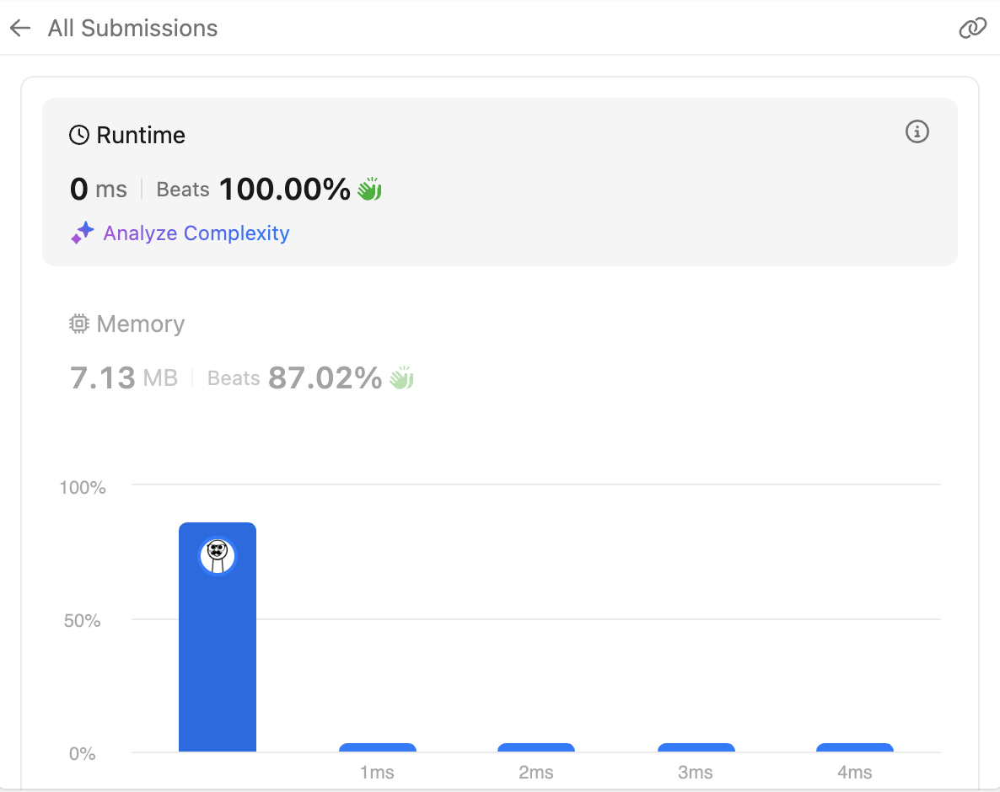

# 98. Validate Binary Search Tree

<br>

---

<br>

link: https://leetcode.com/problems/validate-binary-search-tree/description/

> Given the root of a binary tree, determine if it is a valid binary search tree (BST).

<br>

## Thinking

A valid BST is defined as follows:

* The left subtree of a node contains only nodes with keys strictly less than the node's key.
* The right subtree of a node contains only nodes with keys strictly greater than the node's key.
* Both the left and right subtrees must also be binary search trees.

<br>

**Topic**

* Tree
* Depth-First Search
* Binary Search Tree
* Binary Tree

<br>

So left leaf must smaller than root, and right leaf must bigger than root.

And I try like this:

```go
func isValidBST(root *TreeNode) bool {
	if root == nil {
		return true
	}

	rootVal := root.Val

	if root.Left != nil && root.Left.Val >= rootVal {
		return false
	}
	if root.Right != nil && root.Right.Val <= rootVal {
		return false
	}

	return isValidBST(root.Left) && isValidBST(root.Right)
}
```

It is wrong, because it can not identify a invalid binary-tree like this:

```go
    5
  /   \
 4     6
      / \
     3   7
```

3 is lower than 4, it should be stay in left side of node-4.

<br>

The Key Insight: __Think about what valid range each node can have:__

* The root can be any value
* When you go left, you're adding an upper bound (must be less than parent)
* When you go right, you're adding a lower bound (must be greater than parent)

As you traverse down the tree, each node inherits constraints from all its ancestors, not just its immediate parent.

<br>

**Hint**:

1. Track the valid range: As you recurse, pass along what the valid range is for each node
2. Initial range: Start with `(-∞, +∞)` for the root
3. Update the range: When going left, what changes? When going right, what changes?

<br>
<br>

## Coding

```go
// Definition for a binary tree node.
type TreeNode struct {
	Val   int
	Left  *TreeNode
	Right *TreeNode
}

type Side int8

const (
	NONE Side = iota
	LEFT
	RIGHT
)

func isValidBST(root *TreeNode) bool {
	return perform(root, -1, NONE)
}

func perform(node *TreeNode, parentVal int, side Side) bool {
	if node == nil {
		return true
	}

	switch side {
	case NONE:
		if node.Left != nil {
			if node.Left.Val >= node.Val {
				return false
			}
		}

		if node.Right != nil {
			if node.Right.Val <= node.Val {
				return false
			}
		}

		break

	case LEFT:

		if node.Left != nil {
			if node.Left.Val >= node.Val {
				return false
			}
		}

		if node.Right != nil {
			if node.Right.Val <= node.Val || node.Right.Val >= parentVal {
				return false
			}
		}

		break
	case RIGHT:

		if node.Left != nil {
			if node.Left.Val <= parentVal || node.Left.Val >= node.Val {
				return false
			}
		}

		if node.Right != nil {
			if node.Right.Val <= node.Val {
				return false
			}
		}

		break
	}

	return perform(node.Left, node.Val, LEFT) && perform(node.Right, node.Val, RIGHT)
}
```

<br>

I tried my best but I'm failed. 


I think I made this too complex, if there is a func which gonna tell me input node is valid or not.
The func signature will be like this:

```go
func perform(node *TreeNode, min, max int) bool
```

input node value should between `min` and `max`.

then recursive call `perform(node.Left) && perform(node.Right)`.

<br>

```go
func isValidBST(root *TreeNode) bool {
	return perform(root, math.MinInt64, math.MaxInt64)
}

func perform(node *TreeNode, min, max int) bool {
	if node == nil {
		return true
	}

	if node.Val >= max || node.Val <= min {
		return false
	}

	return perform(node.Left, min, node.Val) && perform(node.Right, node.Val, max)
}
```


