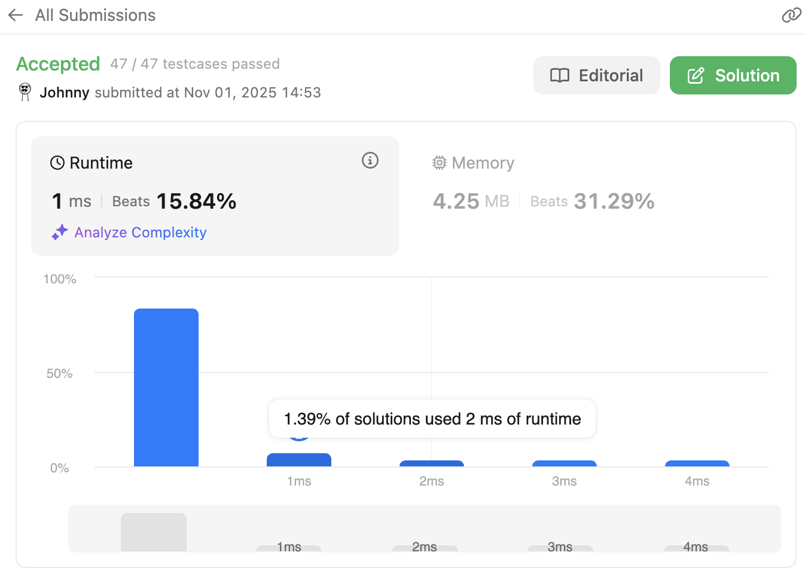
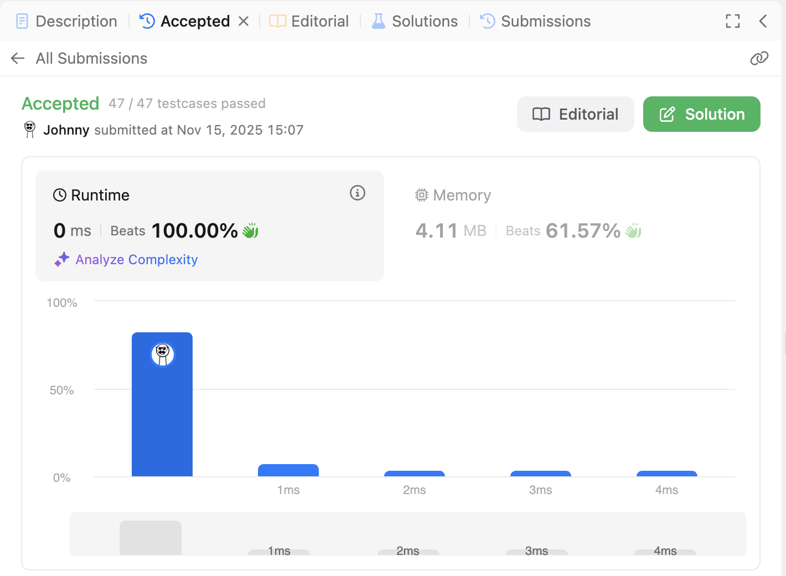

# 139. Word Break

<br>

---

<br>

link: https://leetcode.com/problems/word-break/description/

<br>
<br>

## Thinking

**What are you trying to determine?**

* Think about what information you need at each position in the string
* What does it mean for a substring to be "valid" in this context?

**What smaller problems could help solve the bigger problem?**

* If you know something about the first part of the string, how does that help with the rest?
* Consider: if you can break `s[0...i]` into valid words, what do you need to check for `s[0...j]` where `j > i`?

<br>

### Hint for DP State:

Think about this: 

* Instead of trying to break the entire string at once, what if you asked yourself a simpler question for each position in the string?

* The DP state often answers a yes/no question about a prefix of your string. What would be a useful yes/no question to ask about each prefix?

<br>
<br>

### Define DP

```go
dp := []bool{}
```

<br>

Using `dp[i]` to represent whether `s[0..i]` can be broken into valid words.

* If I know `dp[i]` is true (meaning `s[0..i]` can be validly broken).
* And I can find a word in the dictionary that matches `s[i+1...j]`
* Then I can say `dp[j]` is valid (from `s[0...j]` is valid).

<br>

### Further

Let's take a example: 

```go
s := "catsandog"
dict := []string{"cats", "dog", "sand", "and", "cat"}
```

define `dp := []bool{}`

* dp[0] always true, because empty string always valid.
* when `i = 0`: dp -> `[O, X]` (check `s[0]` -> "c" is not a valid word)
* when `i = 1`: dp -> `[O, X, X]` (check `s[0..1]` -> "ca" is not a valid word)
* when `i = 2`: dp -> `[O, X, X, O]` (check `s[0..2]` -> "cat" is a valid word)
* when `i = 3`: dp -> `[O, X, X, O, O]` (check `s[0..3]` -> "cats" is a valid word)
* when `i = 4`: dp -> `[O, X, X, O, O, X]` 
  * check `s[0..4]` -> "catsa" is X, 
  * check `s[3..4]` -> "sa" is X, 
  * check `s[4]` -> "a" is X.
  * (We only have to check every previous DP with true value index, that could be separate word)
* when `i = 5`: dp -> `[O, X, X, O, O, X, X]`
  * check `s[0..5]` -> "catsan" is X,
  * check `s[3..5]` -> "san" is X,
  * check `s[4..5]` -> "an" is X.
* when `i = 6`: dp -> `[O, X, X, O, O, X, X, O]`
    * check `s[0..6]` -> "catsand" is X,
    * check `s[3..6]` -> "sand" is O
* when `i = 7`: dp -> `[O, X, X, O, O, X, X, O, X]`
    * check `s[0..7]` -> "catsando" is X,
    * check `s[3..7]` -> "sando" is X,
    * check `s[4..7]` -> "ando" is X,
    * check `s[7]` -> "o" is X.
* when `i = 8`: dp -> `[O, X, X, O, O, X, X, O, X, X]`
    * check `s[0..8]` -> "catsandog" is X,
    * check `s[3..8]` -> "sandog" is X,
    * check `s[4..8]` -> "andog" is X,
    * check `s[7..8]` -> "og" is X.

<br>

```
dp: [true false false false true true false false true false]
```
Return `dp[len(nums)]` as result -> `false`.

<br>

## Coding 

```go
func wordBreak(s string, wordDict []string) bool {
	// dump wordDict into a set, optimize finding word.
	wordDictSet := make(map[string]bool)
	for _, word := range wordDict {
		wordDictSet[word] = true
	}

	// define DP
	dp := make([]bool, len(s)+1)
	dp[0] = true // empty string always be true

	// iterate through the s.
	for currentDPIdx := 1; currentDPIdx < len(dp); currentDPIdx++ {

		for j := 0; j <= currentDPIdx; j++ {
			if dp[j] {
				targetWord := s[j:currentDPIdx]
				if _, ok := wordDictSet[targetWord]; ok {
					dp[currentDPIdx] = true
					break
				}
			}
		}

	}

	return dp[len(s)]
}
```

<br>

Result:



<br>

Performance is poor, Just as I expected. I'm using too much for loop, although I tried break earlier.

<br>
<br>

## Revamp

### The Key Insight for Optimization

Instead of checking all possible starting positions, we should only check word lengths that actually exist in our dictionary.

Think about it this way:

* if wordDict only contaions words of length `3, 5, 7`
* Why would I check substrings of length `1, 2, 4, 6` ?

<br>

### Hint for Optimization

1. Pre-process the dict to find the minimum and maximum word lengths.
2. __Reverse inner loop direction__ - instead of iterating `j` from `0` to `currentDPIdx`, iterate backwards from `currentDPIdx`.
3. __Only check valid word lengths__ - skip lengths that don't exist in our dict.

<br>

### Coding - V2

```go
func wordBreak(s string, wordDict []string) bool {
	if len(s) == 0 {
		return false
	}

	// 1. dump wordDict into a map
	wordSet := make(map[string]bool)
	wordLenSet := make(map[int]bool)
	for _, word := range wordDict {
		wordSet[word] = true
		wordLenSet[len(word)] = true
	}

	// 2. init dp: dp[i] -> from s[0...i] can be broken into valid words.
	dp := make([]bool, len(s)+1)
	dp[0] = true // empty string is valid as default.

	// example> s := "catsandog"

	for i := 0; i < len(s)+1; i++ { // `i` is input s's index

		for j := 0; j < i; j++ {

			if dp[j] && wordLenSet[i-j] {
				targetWord := s[j:i]
				if wordSet[targetWord] {
					dp[i] = true
				}
			}
		}

	}

	return dp[len(s)]
}
```

Result:

