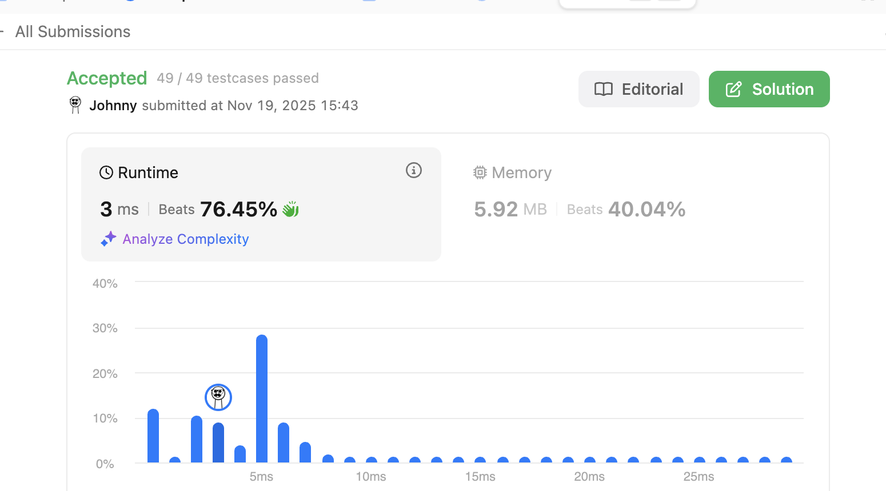

# 200. Number of Islands

<br>

---

<br>

link: https://leetcode.com/problems/number-of-islands

<br>
<br>

## Thinking

Given an `m x n` 2D binary grid grid which represents a map of '1's (land) and '0's (water), return the number of islands.

An island is surrounded by water and is formed by connecting adjacent lands horizontally or vertically. You may assume all four edges of the grid are all surrounded by water.


<br>

As I know, this is the first problem of graph series. and it marked topic with __BFS/DFS__.

<br>

### why this is a graph problem:

1. Connected Components: An island is essentially a group of connected `1`s (land cells). In graph theory, we call these "connected components" - subgraph where every node can reach every other node within that subgraph.
2. Implicit Graph Structure: The 2D grid forms an implicit graph where:
   * Each cell is a node.
   * Adjacent cells (up, down, left right) form edges.
   * We only care about edges between land cells (`1`s).

<br>

### Core Insight

The key insight is: counting islands = counting connected components of `1`s

<br>

* If we stand on any land cell (`1`), we can walk to all connected land cells without crossing water zone.
* All cells we can reach form one island.
* Once we've visited an entire island, any unvisited `1` must belong to a different island.

<br>

### Approach

**Approach-1: Depth-First Search (DFS)**: The Exploration Approach

Imagine we are explorer, when we find a new land:

1. Mark the current position as "visited".
2. Explore in all 4 directions recursively.
3. Keep going until we hit water or hit boundaries.

<br>

**Why DFS?**

* DFS naturally explores an entire connected component before moving on.
* It uses the call stack to remember where we've been
* Perfect for "flood fill" type problems where we want to mark/process an entire region.

<br>
<br>

**Approach-2: Breadth-First Search (BFS)**: The Layer-by-Layer Approach

instead of diving depp immediately, we explore layer by layer:

1. Start from a land cell.
2. Visit all immediate neighbors first.
3. Then visit neighbors of neighbors.
4. Continue until the entire island is mapped.

<br>

**Why BFS?**

* BFS also explores entire connected components
* Uses a queue instead of recursion
* Better if we care about "Distance" or "Short Path" (not needed by this problem)

<br>
<br>

### Build Graph Problem Intuition

When you see a grid problem, ask yourself:

1. What are the nodes? (each cell)
2. What are the edges? (adjacency between land cells)
3. What am I counting/finding? (number of separate component)
4. Do I need to track visited nodes? (almost always yes in grid problems)
5. DFS or BFS? (Both work for connected components; DFS is often simpler)

<br>
<br>

### Common Patterns This Problem Teaches

* **Flood Fill Pattern**: Starting from a point, "fill" all connected cells.
* **Connected Components**: Count separate groups in a graph.
* **Grid as Graph**: 2D arrays often represent implicit graphs.
* **Marking Visited**: Modify in-place or use separate visited set.

<br>
<br>

## Coding - DFS

<br>

1. I want to create a 2D bool array as "visited" land mark array.
2. Iterate through the map:
   * If the node is a __land cell__ `&&` __not been visited__:
     * Start DFS recursive call to explore all the connected component from current node, mark al of them as "visited" (in 2D bool array).
     * After the explore call is over, count the discovered island + 1.
   * If the node is __water cell__ `||` __been visited__:
     * Skip to next cell.
* Return the discovered island count as result.

<br>

```go
type Context struct {
	visited   [][]bool
	grid      [][]byte
	maxRowCnt int
	maxColCnt int
	landCnt   int
}

func (c *Context) findOne() {
	c.landCnt++
}

func (c *Context) markAsVisited(i int, j int) {
	c.visited[i][j] = true
}

func newContext(grid [][]byte) *Context {
	visited := make([][]bool, len(grid))
	for i := range visited {
		visited[i] = make([]bool, len(grid[i]))
	}
	return &Context{
		visited:   visited,
		grid:      grid,
		maxRowCnt: len(grid) - 1,
		maxColCnt: len(grid[0]) - 1,
		landCnt:   0,
	}
}

func numIslands(grid [][]byte) int {
	context := newContext(grid)

	// Iterate through the map:
	for i := 0; i < len(grid); i++ {
		for j := 0; j < len(grid[i]); j++ {

			if grid[i][j] == '1' && !context.visited[i][j] {
				// perform DFS recursive explore >>>
				exploreIsland(context, i, j)
				// <<< perform DFS recursive explore
				context.findOne()
			} else {
				continue
			}
		}
	}

	return context.landCnt
}

func exploreIsland(context *Context, i, j int) {
	if i < 0 || i > context.maxRowCnt || j < 0 || j > context.maxColCnt {
		// reached the edge of grid, just return.
		return
	}

	if context.grid[i][j] == '0' || context.visited[i][j] {
		// return if reach the water cell or already visited.
		return
	}

	context.markAsVisited(i, j)
	// up
	exploreIsland(context, i-1, j)
	// down
	exploreIsland(context, i+1, j)
	// left
	exploreIsland(context, i, j-1)
	// right
	exploreIsland(context, i, j+1)
}
```

<br>

Result: 

<br>

## Revamp - DFS

1. reduce func call, like `markAsVisited()` and `findOne()`
2. Passing context everywhere and dereferencing fields adds overhead.
3. Redundant Boundary Storage. Storing `maxRowCnt` and `maxColCnt` means extra memory access vs. using len() directly (which Go optimizes well).

```go
func numIslands(grid [][]byte) int {
	if len(grid) == 0 {
		return 0
	}

	rows, cols := len(grid), len(grid[0])
	visited := make([][]bool, rows)
	for i := range visited {
		visited[i] = make([]bool, cols)
	}

	// define DFS closure func.
	var dfs func(row, col int)
	dfs = func(row, col int) {
		// combined boundary check
		if row < 0 || row >= rows || col < 0 || col >= cols ||
			visited[row][col] || grid[row][col] != '1' {
			return
		}

		visited[row][col] = true

		// explore all 4 directions
		dfs(row+1, col)
		dfs(row-1, col)
		dfs(row, col-1)
		dfs(row, col+1)
	}

	// perform
	islands := 0
	for i := 0; i < rows; i++ {
		for j := 0; j < cols; j++ {
			if grid[i][j] == '1' && !visited[i][j] {
				dfs(i, j)
				islands++
			}
		}
	}

	return islands
}
```

<br>

Result: 


I resubmit again, it changed to 3ms.

<br>
<br>

## Coding - BFS

### Key Insight: One Queue Per Island

Unlike a binary tree where we traverse the entire tree with one queue, in the island problem:

* Each island gets its own BFS queue.
* We only queue cells from the current island we're exploring.
* The queue helps us explore one island completely before we moving to the next.

```go
type Queue struct {
	pipe [][]int
}

func (q *Queue) Push(row, col int) {
	q.pipe = append(q.pipe, []int{row, col})
}

func (q *Queue) Pop() (int, int, bool) {
	if len(q.pipe) == 0 {
		return 0, 0, false
	}
	box := q.pipe[0]
	q.pipe = q.pipe[1:]
	return box[0], box[1], true
}

func NewQueue() *Queue {
	queue := &Queue{pipe: [][]int{}}
	return queue
}

func numIslands(grid [][]byte) int {
	if len(grid) == 0 {
		return 0
	}

	rows, cols := len(grid), len(grid[0])
	visited := make([][]bool, rows)
	for i := range visited {
		visited[i] = make([]bool, cols)
	}

	directions := [][]int{{-1, 0}, {1, 0}, {0, -1}, {0, 1}}

	// define BFS closure func
	bfs := func(startRow, startCol int) {
		queue := NewQueue()
		queue.Push(startRow, startCol)
		visited[startRow][startCol] = true

		// loop to explore land cells from queue.
		for {
			row, col, ok := queue.Pop()
			if !ok {
				break
			}

			// check all 4 neighbors
			for _, direction := range directions {
				newRow, newCol := row+direction[0], col+direction[1]

				// check boundaries & conditions
				if newRow >= 0 && newRow < rows && // in map
					newCol >= 0 && newCol < cols && // in map
					grid[newRow][newCol] == '1' && // is land cell
					!visited[newRow][newCol] { // not been visited
					visited[newRow][newCol] = true // mark before queuing
					queue.Push(newRow, newCol)
				}
			}
		}
	}

	// using BFS to explore whole island
	island := 0
	for i := 0; i < rows; i++ {
		for j := 0; j < cols; j++ {
			if grid[i][j] == '1' && !visited[i][j] {
				bfs(i, j)
				island++
			}
		}
	}

	return island
}
```

<br>

Result


