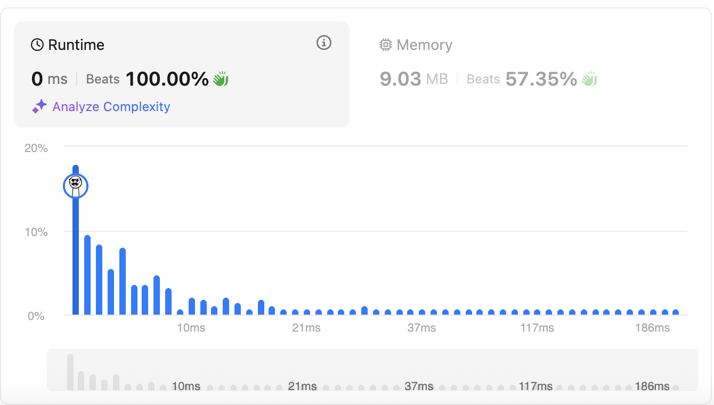
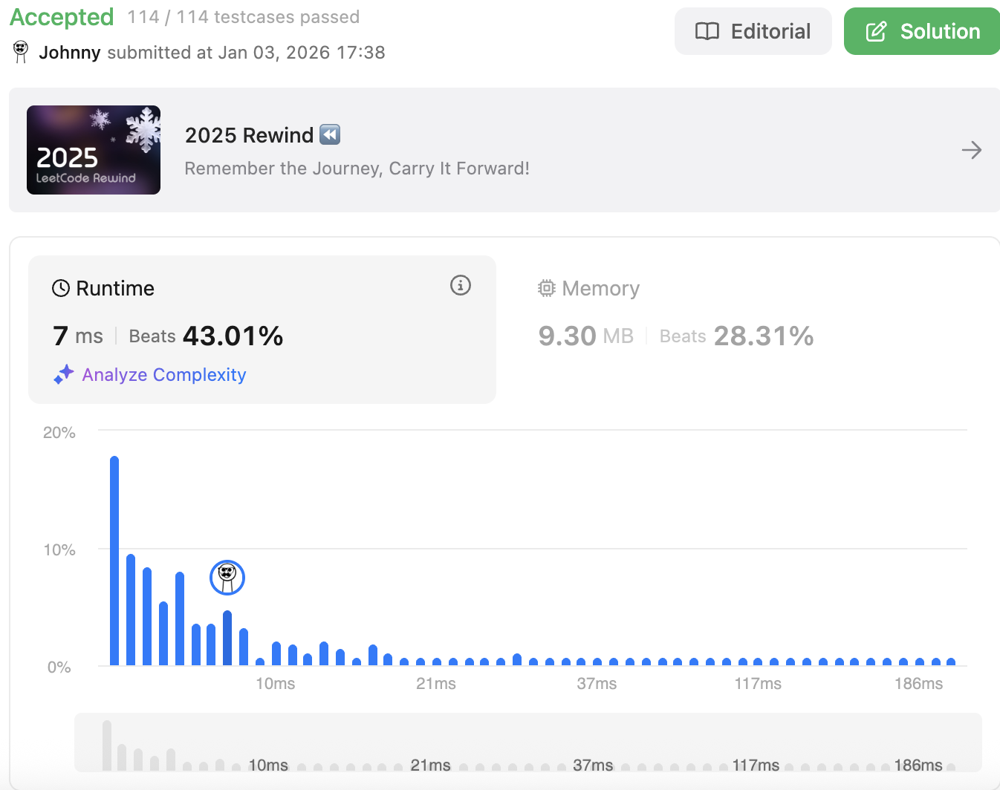

# 417. Pacific Atlantic Water Flow

<br>

---

<br>

link: https://leetcode.com/problems/pacific-atlantic-water-flow/description/

<br>

---

<br>

## Thinking

### Constraints:

```
m == heights.length
n == heights[r].length
1 <= m, n <= 200
0 <= heights[r][c] <= 105
```

### Topics:

* Array
* Depth-First Search
* Breadth-First Search
* Matrix

<br>

### Deconstruct the Problem

Check every cells, explore to **Pacific (Up, Left) and Atlantic (Down , Right)**.

If can reach the 1 edge of Pacific and 1 edge of Atlantic, that means we found one of the results.

<br>

### Refine the Approach

__Start from each cell → Can I reach Pacific? Can I reach Atlantic?__

This means for each cell, you might do two separate explorations. With an `m × n` grid, that's potentially expensive.

**Reverse the Direction**

Instead of asking:

> "From this cell, can water flow to the ocean?"

What if you asked:

> "From the ocean, which cells can water flow from?"


* Water flows from higher or equal height to lower or equal height
* If we reverse the perspective, you're asking: **starting from the ocean edge, which cells can reach this ocean (going uphill or flat)?**

<br>

So, I guess, we should make 2 DFS searching, starting from Pacific side and Atlantic side.

Using a data structure to mark which cell can flow water to target Pacific or target Atlantic,

and finally, return cascade of 2 marks table.

data structure:

```go
pacific := make([][]bool, m)
atlantic := make([][]bool, m)
```

<br>

---

<br>

## Coding - DFS

The DFS function should:

* Take the previous cell's height as a parameter (or the current cell being explored from the edge)
* Mark current cell as reachable
* Explore all 4 directions
* Only recurse if neighbor's height >= current height

```go
func pacificAtlantic(heights [][]int) [][]int {
	// Step-1. create data structure to mark which cell can flow water to target Pacific or target Atlantic.
	pacific := make([][]bool, len(heights))
	for i := range pacific {
		pacific[i] = make([]bool, len(heights[i]))
	}

	atlantic := make([][]bool, len(heights))
	for i := range atlantic {
		atlantic[i] = make([]bool, len(heights[i]))
	}

	rowLen := len(heights)
	colLen := len(heights[0])

	// Step-2. Write the DFS Function
	// - row, col — current cell position
	// - prevHeight — the height of the cell we came from (to check if we can flow "uphill")
	// - reachable — which mark table to update (pacific or atlantic)
	// Logic inside:
	// 1. Boundary check — is row, col within the grid?
	// 2. Already visited? — if reachable[row][col] is true, skip
	// 3. Height check — can we move here? (heights[row][col] >= prevHeight)
	// 4. Mark as reachable
	// 5. Explore all 4 directions (up, down, left, right)
	var dfs func(row, col, prevHeight int, reachable [][]bool)
	dfs = func(row, col, prevHeight int, reachable [][]bool) {
		// 1. Boundary check (if outside the grid, skip)
		if row < 0 || row > rowLen-1 || col < 0 || col > colLen-1 {
			return
		}

		// 2. Already visited? — if reachable[row][col] is true, skip
		if reachable[row][col] {
			return
		}

		// 3. Height check — can we move here? (heights[row][col] >= prevHeight)
		currentHeight := heights[row][col]
		if currentHeight >= prevHeight {
			// 4. Mark as reachable
			reachable[row][col] = true
		} else {
			return
		}

		// 5. Explore all 4 directions (up, down, left, right)
		dfs(row-1, col, currentHeight, reachable) // up
		dfs(row+1, col, currentHeight, reachable) // down
		dfs(row, col-1, currentHeight, reachable) // left
		dfs(row, col+1, currentHeight, reachable) // right
	}

	// Step-3: Call DFS from All Edge Cells
	// - from Pacific edges:
	// TOP:
	for i := range colLen {
		dfs(0, i, 0, pacific)
	}
	// Left:
	for i := range rowLen {
		dfs(i, 0, 0, pacific)
	}

	// - from Atlantic edges:
	// Bottom:
	for i := range colLen {
		dfs(rowLen-1, i, 0, atlantic)
	}

	// Right:
	for i := range rowLen {
		dfs(i, colLen-1, 0, atlantic)
	}

	// Step-4: Find the Intersection
	result := [][]int{}

	for i := range rowLen {
		for j := range colLen {
			if atlantic[i][j] && pacific[i][j] {
				result = append(result, []int{i, j})
			}
		}
	}

	return result
}
```

<br>



<br>

---

<br>

## Coding - BFS

In BFS, the queue holds **cells waiting to be processed**.

Each cell is identified by its position: `(row, col)`.

So each element in the queue is a pair of integers: `[row, col]`.

example:

```
queue = [
    [0, 0],   // cell at row 0, col 0
    [0, 1],   // cell at row 0, col 1
    [1, 0],   // cell at row 1, col 0
    ...
]
```

<br>

```go
func pacificAtlantic(heights [][]int) [][]int {
	// Step-1. create data structure to mark which cell can flow water to target Pacific or target Atlantic.
	pacific := make([][]bool, len(heights))
	for i := range pacific {
		pacific[i] = make([]bool, len(heights[i]))
	}

	atlantic := make([][]bool, len(heights))
	for i := range atlantic {
		atlantic[i] = make([]bool, len(heights[i]))
	}

	rowLen := len(heights)
	colLen := len(heights[0])

	// Step 2: BFS function, startCells represent cells that waiting for process.
	bfs := func(startCells [][]int, reachable [][]bool) {
		queue := startCells // initialize with edge cells

		for len(queue) > 0 {
			// pop from front
			cell := queue[0]
			queue = queue[1:]
			row := cell[0]
			col := cell[1]

			reachable[row][col] = true

			currentHeight := heights[row][col]
			// check 4 neighbors
			// if valid and height >= current, add to queue and mark

			// check up:
			upRow := row - 1
			if (upRow >= 0 && upRow < rowLen) && (col >= 0 && col < colLen) && !reachable[upRow][col] {
				upHeight := heights[upRow][col]
				if upHeight >= currentHeight {
					queue = append(queue, []int{upRow, col})
				}
			}

			// check down:
			downRow := row + 1
			if (downRow >= 0 && downRow < rowLen) && (col >= 0 && col < colLen) && !reachable[downRow][col] {
				downHeight := heights[downRow][col]
				if downHeight >= currentHeight {
					queue = append(queue, []int{downRow, col})
				}
			}

			// check left:
			leftCol := col - 1
			if (row >= 0 && row < rowLen) && (leftCol >= 0 && leftCol < colLen) && !reachable[row][leftCol] {
				leftHeight := heights[row][leftCol]
				if leftHeight >= currentHeight {
					queue = append(queue, []int{row, leftCol})
				}
			}

			// check right:
			rightCol := col + 1
			if (row >= 0 && row < rowLen) && (rightCol >= 0 && rightCol < colLen) && !reachable[row][rightCol] {
				rightHeight := heights[row][rightCol]
				if rightHeight >= currentHeight {
					queue = append(queue, []int{row, rightCol})
				}
			}
		}
	}

	// Step 3: Collect starting cells for each ocean (all the edge cells)
	startCellsForPacific := [][]int{}
	for i := range rowLen {
		startCellsForPacific = append(startCellsForPacific, []int{i, 0})
	}
	for i := 1; i < colLen; i++ {
		startCellsForPacific = append(startCellsForPacific, []int{0, i})
	}

	startCellsForAtlantic := [][]int{}
	for i := range rowLen {
		startCellsForAtlantic = append(startCellsForAtlantic, []int{i, colLen - 1})
	}
	for i := 0; i < colLen-1; i++ {
		startCellsForAtlantic = append(startCellsForAtlantic, []int{rowLen - 1, i})
	}

	// Step 4: Call bfs for pacific, then atlantic
	bfs(startCellsForPacific, pacific)
	bfs(startCellsForAtlantic, atlantic)

	// Step 5: Find intersection
	result := [][]int{}

	for i := range rowLen {
		for j := range colLen {
			if atlantic[i][j] && pacific[i][j] {
				result = append(result, []int{i, j})
			}
		}
	}

	return result
}
```

<br>

