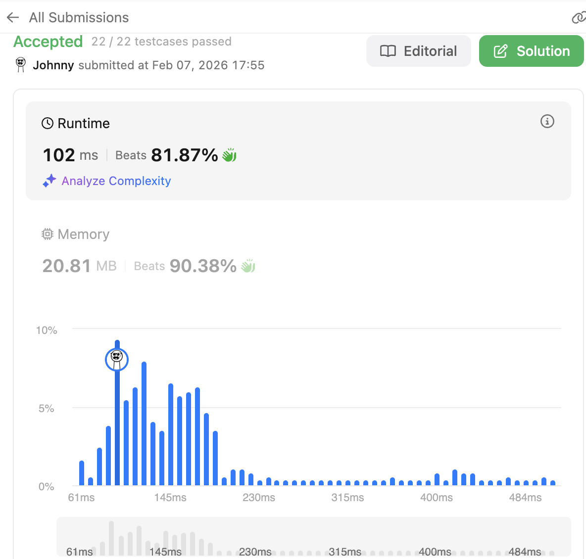

# 295. Find Median from Data Stream

<br>

---

<br>

link: https://leetcode.com/problems/find-median-from-data-stream/description/

<br>
<br>

## Thinking

### Topic:

* Two Pointers
* Design
* Sorting
* Heap (Priority Queue)
* Data Stream

<br>

### Approach we can try:

1. Insertion Sort — easiest to understand
2. Two Heaps — the "aha!" solution, most elegant
3. Balanced BST — More complex to implement


<br>

---

<br>

## Insertion Sort

### The Idea

Keep a sorted slice. When a new number comes:

1. Find the correct position (binary search)
2. Insert it there

**How do you find the insertion position efficiently?**

I think we can use a array to store the income data as data stream. 
and we're using binary search to find the target position index.

**After finding the position, how do you insert in Go?**

Just like regular array insert into the middle of the data array, and move every right element forward to right side.

**What's the complexity of each operation?**

Find the position index is O(Log N), insert action is O(N)

<br>
<br>

### Coding

```go
type MedianFinder struct {
	data []int
}

func Constructor() MedianFinder {
	return MedianFinder{
		data: make([]int, 0),
	}
}

func (this *MedianFinder) AddNum(num int) {
	if len(this.data) == 0 {
		this.data = append(this.data, num)
		return
	}

	// find the insert position idx:
	left, right := 0, len(this.data)-1 // init start end.
	positionIdx := this.binarySearch(num, left, right)

	// perform insert:
	this.data = append(this.data, 0) // extend 1 slot.
	copy(this.data[positionIdx+1:], this.data[positionIdx:])
	this.data[positionIdx] = num
}

func (this *MedianFinder) FindMedian() float64 {
	dataLen := len(this.data)
	// odd or even:
	isOdd := dataLen%2 == 1

	if isOdd {
		return float64(this.data[dataLen/2])
	} else {
		// even
		a := this.data[dataLen/2]
		b := this.data[dataLen/2-1]
		return float64(a+b) / 2
	}
}

func (this *MedianFinder) binarySearch(num, left, right int) int {
	if left >= right {
		if this.data[left] > num {
			return left
		} else {
			return left + 1
		}
	}

	middle := (right + left) / 2 // calculate middle

	if this.data[middle] == num {
		return middle + 1
	} else if this.data[middle] > num {
		return this.binarySearch(num, left, middle-1)
	} else {
		return this.binarySearch(num, middle+1, right)
	}
}
```


<br>
<br>

## 2 Heap

### The Two Heaps Strategy

```
        Max-Heap              Min-Heap
       (left half)           (right half)
    smaller elements        larger elements
           ↓                      ↓
    [... small ...]         [... large ...]
           ↑                      ↑
         top =                  top = 
    largest of small       smallest of large
```

<br>

### Think Through This Example

```
Stream: [5, 2, 8, 1, 9]

After adding 5:
  maxHeap: [5]    minHeap: []
  median = 5

After adding 2:
  maxHeap: [2]    minHeap: [5]
  median = (2 + 5) / 2 = 3.5

After adding 8:
  maxHeap: [2]    minHeap: [5, 8]
  Unbalanced! Move 5 to maxHeap...
  maxHeap: [5, 2]  minHeap: [8]
  median = 5

After adding 1:
  maxHeap: [5, 2, 1]  minHeap: [8]
  Unbalanced! Move 5 to minHeap...
  maxHeap: [2, 1]  minHeap: [5, 8]
  median = (2 + 5) / 2 = 3.5

After adding 9:
  maxHeap: [2, 1]  minHeap: [5, 8, 9]
  Unbalanced! Move 5 to maxHeap...
  maxHeap: [5, 2, 1]  minHeap: [8, 9]
  median = 5
```

<br>

### Coding

```go

import (
	"container/heap"
	"math"
)

type IntHeap struct {
	data  []int
	isMin bool
}

func NewIntHeap(min bool) *IntHeap {
	return &IntHeap{
		data:  make([]int, 0),
		isMin: min,
	}
}

func (h IntHeap) Peek() int {
	if len(h.data) == 0 {
		return math.MinInt
	}

	return h.data[0]
}

func (h IntHeap) Len() int {
	return len(h.data)
}

// Less i's priority is larger than j ?
func (h IntHeap) Less(i, j int) bool {
	if h.isMin {
		return h.data[i] < h.data[j]
	} else {
		return h.data[i] > h.data[j]
	}
}

func (h *IntHeap) Swap(i, j int) {
	h.data[i], h.data[j] = h.data[j], h.data[i]
}

func (h *IntHeap) Push(x interface{}) {
	h.data = append(h.data, x.(int))
}

func (h *IntHeap) Pop() interface{} {
	x := h.data[h.Len()-1]
	h.data = h.data[:h.Len()-1]
	return x
}

type MedianFinder struct {
	leftHeap  *IntHeap
	rightHeap *IntHeap
}

func Constructor() MedianFinder {
	return MedianFinder{
		leftHeap:  NewIntHeap(false), // max-heap
		rightHeap: NewIntHeap(true),  // min-heap
	}
}

func (this *MedianFinder) AddNum(num int) {
	if this.leftHeap.Len() == this.rightHeap.Len() { // balance situation
		if this.leftHeap.Peek() >= num || this.leftHeap.Len() == 0 {
			// PUSH to left
			heap.Push(this.leftHeap, num)
		} else {
			// PUSH to right
			heap.Push(this.rightHeap, num)
			if this.rightHeap.Len() > this.leftHeap.Len() {
				tmp := heap.Pop(this.rightHeap) // pop 1 from right and push to left to keep the balance
				heap.Push(this.leftHeap, tmp)
			}
		}
		return
	}

	// unbalance situation
	if this.leftHeap.Peek() >= num {
		heap.Push(this.leftHeap, num)  // num should go left side.
		tmp := heap.Pop(this.leftHeap) // pop 1 from left and push to right to keep the balance
		heap.Push(this.rightHeap, tmp)
	} else {
		heap.Push(this.rightHeap, num) // num should go right side.
		if this.rightHeap.Len() > this.leftHeap.Len() {
			tmp := heap.Pop(this.rightHeap) // pop 1 from right and push to left to keep the balance
			heap.Push(this.leftHeap, tmp)
		}
	}

}

func (this *MedianFinder) FindMedian() float64 {

	if this.leftHeap.Len() == this.rightHeap.Len() {
		left := this.leftHeap.Peek()
		right := this.rightHeap.Peek()
		return float64(left+right) / 2
	} else {
		return float64(this.leftHeap.Peek())
	}
}
```



<br>

I finished this but the code is very dirty, try to refactor this.


1. Always push to left (maxHeap) first
2. Move top of left to right (to ensure ordering)
3. If right is bigger, move top of right back to left

<br>

This is cleaner but iw will take more times.

```go
func (this *MedianFinder) AddNum(num int) {
	// Step 1: Push to left (maxHeap)
	heap.Push(this.leftHeap, num)

	// Step 2: Balance values — move largest of left to right
	heap.Push(this.rightHeap, heap.Pop(this.leftHeap))

	// Step 3: Balance sizes — left should be >= right
	if this.rightHeap.Len() > this.leftHeap.Len() {
		heap.Push(this.leftHeap, heap.Pop(this.rightHeap))
	}
}

func (this *MedianFinder) FindMedian() float64 {

	if this.leftHeap.Len() == this.rightHeap.Len() {
		left := this.leftHeap.Peek()
		right := this.rightHeap.Peek()
		return float64(left+right) / 2
	} else {
		return float64(this.leftHeap.Peek())
	}
}
```

<br>
<br>

## Balanced BST

### Thinking

### Code

```go
// TODO Balanced BST
```
