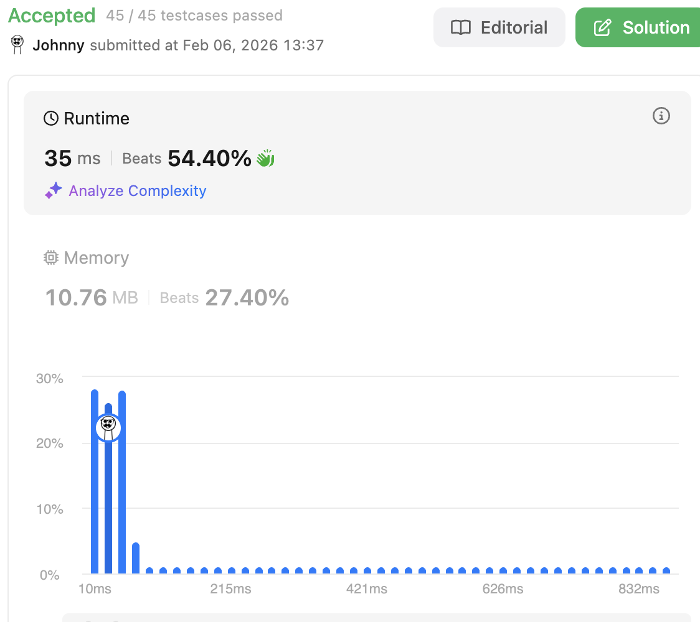

# 215. Kth Largest Element in an Array

<br>

---

<br>

## Topic 

* Array
* Divide and Conquer
* Sorting
* [Heap (Priority Queue)](https://www.bilibili.com/video/BV1Gm4y1S7yY/?spm_id_from=333.337.search-card.all.click&vd_source=9780a181ac9f1fee5f680f255ee5bc73)
* Quickselect (based on QuickSort)

Constraints:

```
1 <= k <= nums.length <= 105
-104 <= nums[i] <= 104
```

<br>
<br>

## Thinking

We're using MIN-HEAP as Priority Queue, And we only need K length for Heap size.

K length of a MIN-HEAP, the HEAD element of the HEAP is **Kth Largest Element in an Array**

<br>
<br>

## Coding Phase-1

```go
import (
	"container/heap"
)

type IntHeap []int

func (h IntHeap) Len() int {
	return len(h)
}

func (h IntHeap) Less(i, j int) bool {
	// min-heap: smaller value = higher priority
	return h[i] < h[j]
}

func (h IntHeap) Swap(i, j int) {
	h[i], h[j] = h[j], h[i]
}

func (h *IntHeap) Push(x any) {
	*h = append(*h, x.(int))
}

func (h *IntHeap) Pop() any {
	old := *h
	n := len(old)
	x := old[n-1]     // grab last element
	*h = old[0 : n-1] // shrink slice
	return x
}

func findKthLargest(nums []int, k int) int {
	H := IntHeap(make([]int, 0))

	for _, num := range nums {
		heap.Push(&H, num)
		if H.Len() > k {
			heap.Pop(&H)
		}
	}

	return H[0]
}
```

<br>

Result:


<br>
<br>

## Coding Phase-2

In Phase-2, I'm gonna try with make a min-heap data structure by my own.

```go

type IntHeap struct {
	isMin bool
	data  []int
}

func NewIntHeap(min bool) *IntHeap {
	return &IntHeap{
		isMin: min,
		data:  make([]int, 0),
	}
}

func (h IntHeap) Peek() int {
	return h.data[0]
}

func (h IntHeap) Len() int {
	return len(h.data)
}

// Less Does h[i] have higher priority than h[j]?
func (h IntHeap) Less(i, j int) bool {
	if h.isMin {
		return h.data[i] < h.data[j]
	} else {
		return h.data[i] > h.data[j]
	}
}

func (h *IntHeap) Swap(i, j int) {
	h.data[i], h.data[j] = h.data[j], h.data[i]
}

// Push Logic: heapifyUp
// 1. append x to the end of data
// 2. compare to the parent node, Swap() if Less() == true
// 3. repeat step 2 until pushed value's priority is lower than current parent or no parent node exists.
func (h *IntHeap) Push(x int) {
	h.data = append(h.data, x)
	currentIdx := len(h.data) - 1

	for {
		parentIdx, exist := h.parentIndex(currentIdx)
		if !exist {
			break // reach the top
		}

		if h.Less(currentIdx, parentIdx) {
			// currentIdx has higher priority than parentIdx
			h.Swap(currentIdx, parentIdx)
			currentIdx = parentIdx
		} else {
			break
		}
	}
}

// Pop Logic: heapifyDown
// 1. save h[0] as pop return value
// 2. swap h[0] and h[n-1] then shrink the slice h.data = h.data[:n-1]
// 3. now we swapped a wrong val at the top, we need swap current h[0] by heapifyDown
// 4. compare current val to the left * right child, swap with the higher priority child. Stop when no child exists OR current val is smaller than both children.
func (h *IntHeap) Pop() int {
	ret := h.data[0]
	h.Swap(0, h.Len()-1)
	h.data = h.data[:h.Len()-1]

	// heapifyDown
	currentIdx := 0
	for {
		leftIdx, leftExists := h.leftChildIndex(currentIdx)
		if !leftExists {
			// left not exists means not any child.
			break
		}

		higherPriorityChildIdx := leftIdx

		rightIdx, rightExists := h.rightChildIndex(currentIdx)
		if rightExists && h.Less(rightIdx, leftIdx) {
			// right has high priority
			higherPriorityChildIdx = rightIdx
		}

		if h.Less(higherPriorityChildIdx, currentIdx) {
			h.Swap(higherPriorityChildIdx, currentIdx)
			currentIdx = higherPriorityChildIdx
		} else {
			break
		}
	}

	return ret
}

// heap parent left right child logic
func (h *IntHeap) leftChildIndex(i int) (int, bool) {
	leftChildIdx := 2*i + 1
	if leftChildIdx >= len(h.data) {
		return -1, false
	} else {
		return leftChildIdx, true
	}
}

// heap parent right child logic
func (h *IntHeap) rightChildIndex(i int) (int, bool) {
	rightChildIdx := 2 * (i + 1)
	if rightChildIdx >= len(h.data) {
		return -1, false
	} else {
		return rightChildIdx, true
	}
}

func (h *IntHeap) parentIndex(i int) (int, bool) {
	if i <= 0 {
		return -1, false
	}
	return (i - 1) / 2, true
}

func findKthLargest(nums []int, k int) int {
	H := NewIntHeap(true)

	for _, num := range nums {
		H.Push(num)
		if H.Len() > k {
			H.Pop()
		}
	}

	// Kth Largest element will sit on the top.
	return H.Peek()
}
```

Result:




<br>
<br>

## Quickselect (based on QuickSort)

<br>

### QuickSort in 30 Seconds

The idea is simple:

1. Pick a **pivot** element
2. **Partition**: move smaller elements left, larger elements right
3. Recurse on both halves

```
[3, 6, 2, 7, 1, 4]
       ↓ pick pivot = 4
[3, 2, 1] [4] [6, 7]    ← partition done
    ↓           ↓
  recurse    recurse
    ↓           ↓
[1, 2, 3]     [6, 7]
       ↓
[1, 2, 3, 4, 6, 7]      ← sorted!
```

### The Key Insight for Quickselect

After partition, the pivot is in its final sorted position.

So if you only need the Kth element, why sort everything? Just check:

1. Pivot at index K? Done!
2. Pivot at index > K? Search left only
3. Pivot at index < K? Search right only

<br>

### QuickSort Example:

```
Array: [3, 6, 2, 7, 1, 4]
                       ↑
                    pivot = 4
```

Goal: Move everything < 4 to the left, everything > 4 to the right

#### The Partition Algorithm (Lomuto Scheme)

We use two pointers:

* `i` — where the next "small" element should be placed
* `j` — scans through the array

<br>

---

Initial State:

```go
[3, 6, 2, 7, 1, 4]
 ↑              ↑
 i              pivot
 j

i = 0, j = 0
```

---

<br>

j = 0: Is nums[j]=3 < pivot=4? YES!

* Swap nums[i] with nums[j] (swap with itself, no change)
* Increment i

```go
[3, 6, 2, 7, 1, 4]
    ↑           ↑
    i           pivot
 ↑
 j

i = 1, j = 0
```

---

j = 1: Is nums[j]=6 < pivot=4? NO!

* Do nothing, just move j

```go
[3, 6, 2, 7, 1, 4]
    ↑           ↑
    i           pivot
    ↑
    j

i = 1, j = 1
```

---

j = 2: Is nums[j]=2 < pivot=4? YES!

* Swap nums[i]=6 with nums[j]=2
* Increment i

```go
[3, 2, 6, 7, 1, 4]
       ↑        ↑
       i        pivot
       ↑
       j

i = 2, j = 2
```

---

j = 3: Is nums[j]=7 < pivot=4? NO!

* Do nothing, just move j

```go
[3, 2, 6, 7, 1, 4]
       ↑        ↑
       i        pivot
          ↑
          j

i = 2, j = 3

```

---

j = 4: Is nums[j]=1 < pivot=4? YES!

* Swap nums[i]=6 with nums[j]=1
* Increment i

```go
[3, 2, 1, 7, 6, 4]
          ↑     ↑
          i     pivot
             ↑
             j

i = 3, j = 4
```

---

j = 5: This is the pivot, stop scanning.
Final step: Swap nums[i] with pivot

```go
[3, 2, 1, 4, 6, 7]
          ↑
       pivot is now at index 3
```

<br>

---

#### Result

```
[3, 2, 1] [4] [6, 7]
   < 4     =    > 4
```

Pivot `4` is now at index `3` — its final sorted position!


<br>

#### The Key Insight

`i` always points to the first element ≥ pivot. 

When we find something < pivot, we swap it into position `i` and grow the "small" section.


### Coding

```go
func quickSort(nums []int) {
	if len(nums) <= 1 {
		return
	}
	start, end := 0, len(nums)-1
	sortPartition(nums, start, end)

}

func sortPartition(nums []int, startIdx, endIdx int) {
	pivot := endIdx

	if startIdx == endIdx {
		return
	}

	i, j := startIdx, startIdx // init 2 pointers

	// i: where the next "small" element should be placed
	// j: scans through the array

	for j < pivot {

		if nums[j] < nums[pivot] {
			// swap i&j
			nums[j], nums[i] = nums[i], nums[j]
			i++
		}

		j++
	}

	// Swap nums[i] with pivot at final
	nums[pivot], nums[i] = nums[i], nums[pivot]

	pivot = i

	if pivot > startIdx {
		sortPartition(nums, startIdx, pivot-1)
	}

	if pivot < endIdx {
		sortPartition(nums, pivot+1, endIdx)
	}
}
```

<br>
<br>

### QuickSelect Approach

<br>

The Kth Largest I think is just like QuickSort, but we only need to focus on right side. 

Each time after we finished 1 round of partition sorting, we can check is current pivot is `len(nums) - K`


```go
func quickSelectKthLargest(nums []int, start, end, k int) int {
	if start == end {
		return nums[start]
	}

	// init 2 pointers:
	i, j := start, start

	for j < end {

		if nums[j] < nums[end] {
			nums[i], nums[j] = nums[j], nums[i]
			i++
		}

		j++
	}

	pivotIdx := i
	nums[pivotIdx], nums[end] = nums[end], nums[pivotIdx]

	if pivotIdx == len(nums)-k {
		return nums[pivotIdx]
	} else if pivotIdx < len(nums)-k {
		return quickSelectKthLargest(nums, pivotIdx+1, end, k)
	} else {
		return quickSelectKthLargest(nums, start, pivotIdx-1, k)
	}
}

func findKthLargest(nums []int, k int) int {
    start, end := 0, len(nums)-1
    return quickSelectKthLargest(nums, start, end, k)
}
```