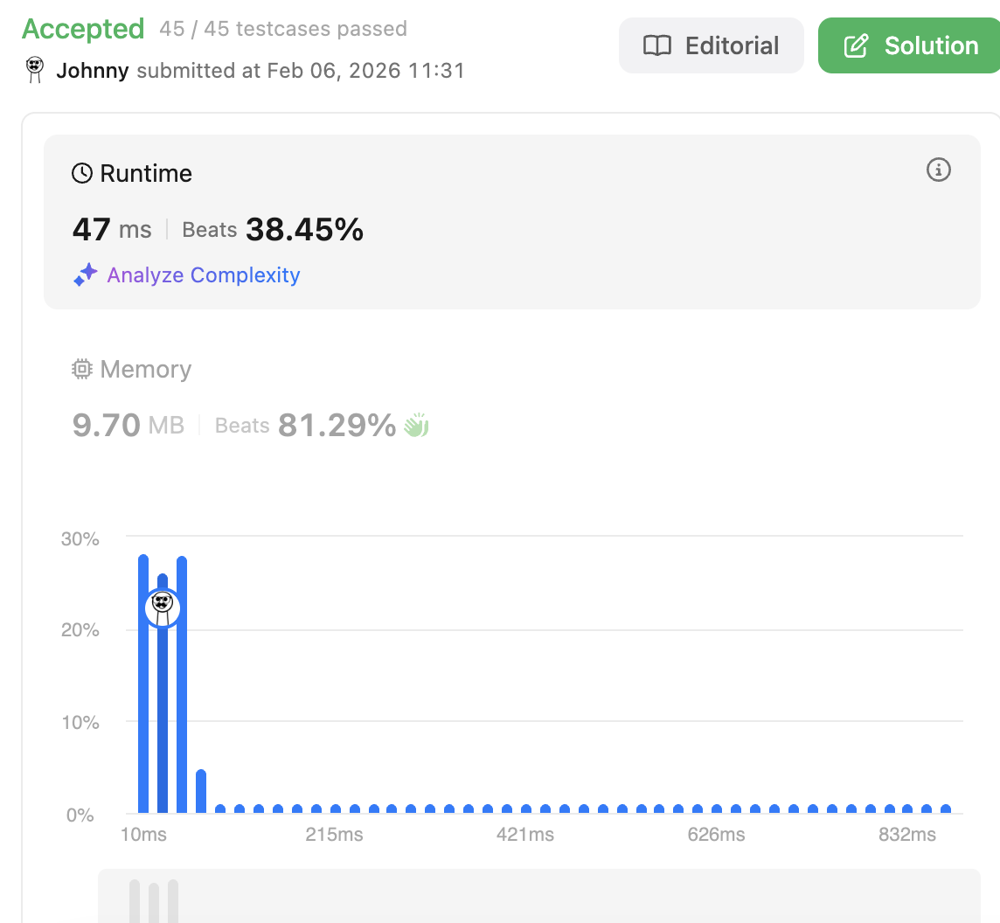

# 215. Kth Largest Element in an Array

<br>

---

<br>

## Topic 

* Array
* Divide and Conquer
* Sorting
* [Heap (Priority Queue)](https://www.bilibili.com/video/BV1Gm4y1S7yY/?spm_id_from=333.337.search-card.all.click&vd_source=9780a181ac9f1fee5f680f255ee5bc73)
* Quickselect

Constraints:

```
1 <= k <= nums.length <= 105
-104 <= nums[i] <= 104
```

<br>
<br>

## Thinking

We're using MIN-HEAP as Priority Queue, And we only need K length for Heap size.

K length of a MIN-HEAP, the HEAD element of the HEAP is **Kth Largest Element in an Array**

<br>
<br>

## Coding

```go
import (
	"container/heap"
)

type IntHeap []int

func (h IntHeap) Len() int {
	return len(h)
}

func (h IntHeap) Less(i, j int) bool {
	// min-heap: smaller value = higher priority
	return h[i] < h[j]
}

func (h IntHeap) Swap(i, j int) {
	h[i], h[j] = h[j], h[i]
}

func (h *IntHeap) Push(x any) {
	*h = append(*h, x.(int))
}

func (h *IntHeap) Pop() any {
	old := *h
	n := len(old)
	x := old[n-1]     // grab last element
	*h = old[0 : n-1] // shrink slice
	return x
}

func findKthLargest(nums []int, k int) int {
	H := IntHeap(make([]int, 0))

	for _, num := range nums {
		heap.Push(&H, num)
		if H.Len() > k {
			heap.Pop(&H)
		}
	}

	return H[0]
}
```

<br>

Result:




