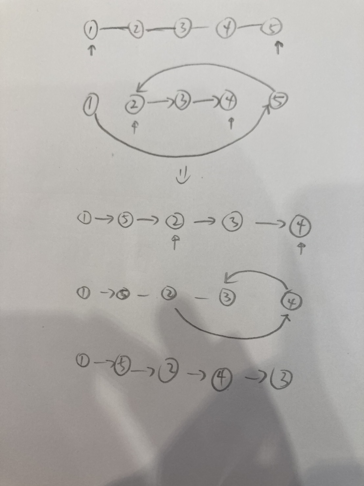

# Reorder List

<br>

---

<br>

link: https://leetcode.com/problems/reorder-list/description/

<br>

## Thinking

<br>



Using 2 pointer, one start from head another from the tail. but it's not a Doubly Linked List, so I can't use a pointer backward from the tail.

<br>

**Topic**

* Linked List
* Two Pointers
* Stack
* Recursion

<br>

Stack is interesting, and me think how does that work in this problem.

Stack's feature is fist in last out.

What if I put all node in to it?

<br>

ex: [1,2,3,4,5]

```go
|5|
|4|
|3|
|2|
|1|
```

<br>

I think that's means I can do backward by stack.

<br>
<br>

## Coding

```go
type ListNode struct {
	Val  int
	Next *ListNode
}

type ListNodeStack struct {
	container []*ListNode
}

func NewListNodeStack() *ListNodeStack {
	return &ListNodeStack{
		container: make([]*ListNode, 0),
	}
}

func (s *ListNodeStack) Push(node *ListNode) {
	s.container = append(s.container, node)
}

func (s *ListNodeStack) Pop() (*ListNode, error) {
	length := len(s.container)
	if length == 0 {
		return nil, fmt.Errorf("stack is empty")
	}

	node := s.container[length-1]
	s.container = s.container[:length-1]
	return node, nil
}

func (s *ListNodeStack) isEmpty() bool {
	return len(s.container) == 0
}

func reorderList(head *ListNode) {
	if head == nil || head.Next == nil {
		return
	}

	// put all node(except head) into stack
	stack := NewListNodeStack()
	tmpPointer := head.Next
	for tmpPointer != nil {
		stack.Push(tmpPointer)
		tmpPointer = tmpPointer.Next
	}

	pointerA := head
	pointerB, _ := stack.Pop() // tail

	for (pointerA != pointerB) && (pointerA.Next != pointerB) {
		fmt.Println("pointerA:", pointerA, "pointerB:", pointerB)
		if stack.isEmpty() {
			break
		}

		CPA := pointerA
		CPB := pointerB

		pointerB, _ = stack.Pop()
		pointerA = pointerA.Next

		CPA.Next = CPB
		CPB.Next = pointerA
	}

	pointerB.Next = nil
}
```

<br>

result:


<br>

I passed that problem, and performance is perfect.
But I don't think this is a good way to solve this problem, because I feel like the code I wrote was hard to read and understand.
I should revamp this.

<br>
<br>

### Claude AI:

**The Optimal O(1) Space Approach**

Theory: Break the problem into 3 steps:

* Find the middle (slow/fast pointer)
* Reverse the second half (in-place pointer manipulation)
* Merge two halves (interleave/交錯)

<br>

### Step 1: Find Middle

```
1 → 2 → 3 → 4 → 5
        ↑
      middle
```

Using slow/fast pointers (slow moves 1, fast moves 2), when fast reaches end, slow is at middle.

<br>

### Step 2: Reverse Second Half

```
Before: 3 → 4 → 5
After:  3 ← 4 ← 5
        ↓
       null
```

This is the classic "reverse linked list" pattern—changing direction of pointers in-place.

<br>

### Step 3: Merge

```
List 1: 1 → 2 → 3
List 2: 5 → 4

Result: 1 → 5 → 2 → 4 → 3
```

Alternate picking from each list.

<br>
<br>

### Tips

**The Pattern to Remember** 

Many linked list problems have this pattern:

```
"I need to access from both ends"
    ↓
Option A: Store in auxiliary structure (O(n) space)
Option B: Find middle + reverse half (O(1) space)
```

<br>

## Revamp

### Coding

```go
func reorderList(head *ListNode) {
	if head == nil || head.Next == nil {
		return
	}

	// 1. using 2 pointer to find the middle.
	pointerA := head // slow-pointer.
	pointerB := head // fast-pointer.

	// ex: 1 - 2 - 3 [4 - 5]  === A: 3, B: 5
	// ex: 1 - 2  [3 - 4]      === A: 2, B: 4
	// pointerA: fist list's tail
	// pointerB: second list's tail
	for pointerB.Next != nil {
		if pointerB.Next.Next != nil {
			pointerB = pointerB.Next.Next // move 2 step.
			pointerA = pointerA.Next      // pointer-A move 1 step.
		} else {
			pointerB = pointerB.Next // move 1 more step.
		}
	}

	// 2. reverse the sec half linked-list.(from pointerB to pointerA)
	secondListHead := pointerB
	pointerB.Next = pointerA.Next
	pointerA.Next = nil // cut the list from the middle.

	currentPointer := secondListHead.Next
	nextPointer := secondListHead.Next.Next

	for currentPointer.Next != secondListHead {
		tmp := nextPointer.Next
		nextPointer.Next = currentPointer
		currentPointer = nextPointer
		nextPointer = tmp
	}
	currentPointer.Next = nil

	pointerA = head
	pointerB = secondListHead
	
	// 3. merge both linked-list and return. (first list's length will equal or 1 bigger than sec list)
	for pointerA != nil && pointerB != nil {
		currentA := pointerA
		currentB := pointerB

		pointerA = pointerA.Next
		pointerB = pointerB.Next

		currentA.Next = currentB
		currentB.Next = pointerA
	}
}
```

finished!

And let me ask AI for improvement.

<br>

```go
type ListNode struct {
	Val  int
	Next *ListNode
}

func reorderList(head *ListNode) {
	if head == nil || head.Next == nil {
		return
	}

	// 1. using 2 pointer to find the middle.
	slow, fast := head, head
	for slow.Next != nil && fast.Next != nil && fast.Next.Next != nil {
		slow = slow.Next
		fast = fast.Next.Next
	}
	// slow will be pointing at the middle.
	// cut second list:
	secHead := slow.Next
	slow.Next = nil
	// now we got head, and sec head. ex: [1, 2, 3] and [4, 5]

	// 2. reverse the sec half linked-list.(using secHead)
	prev := secHead
	curr := secHead.Next
	prev.Next = nil // secHead will be the tail of reversed linked-list
	for curr != nil {
		next := curr.Next // save next
		curr.Next = prev  // reverse link
		prev = curr       // move prev forward
		curr = next       // move curr forward
	}
	// prev is the revered-linked-list new head
	revSecHead := prev

	// 3. merge both linked-list and return. (first list's length will equal or 1 bigger than sec list)
	mergeTwoList(head, revSecHead)
}

func mergeTwoList(head1 *ListNode, head2 *ListNode) {
	for head1 != nil && head2 != nil {
		// 1. store current 2 pointer.
		currA, currB := head1, head2
		// 2. move both pointer forward.
		head1 = head1.Next
		head2 = head2.Next
		// 3. rebuild link
		currA.Next = currB
		currB.Next = head1
	}
}
```

This is perfection!

