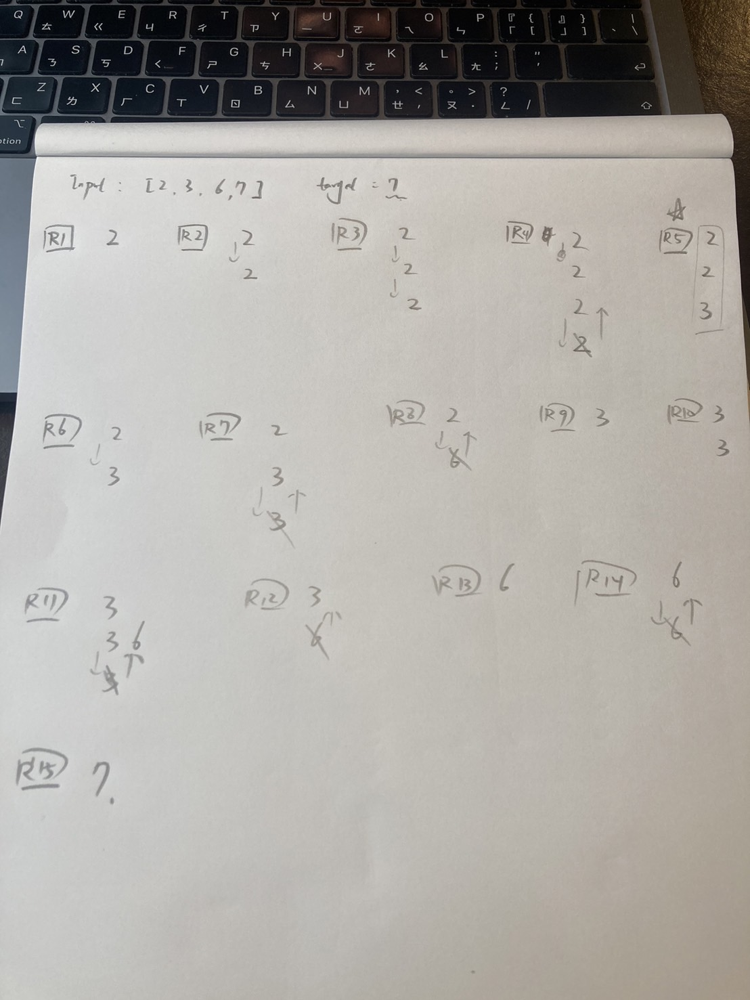
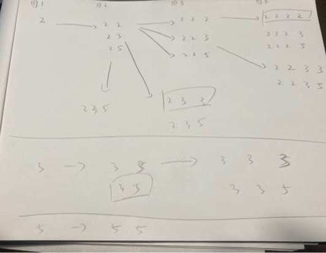

# Combination Sum

<br>

---

<br>

## Desc

Given an array of distinct integers candidates and a target integer target, return a list of all unique combinations of candidates where the chosen numbers sum to target. You may return the combinations in any order.

The same number may be chosen from candidates an unlimited number of times. Two combinations are unique if the
frequency
of at least one of the chosen numbers is different.

The test cases are generated such that the number of unique combinations that sum up to target is less than 150 combinations for the given input.

<br>

Example 1:

<br>

```
Input: candidates = [2,3,6,7], target = 7
Output: [[2,2,3],[7]]
```

Explanation:
2 and 3 are candidates, and 2 + 2 + 3 = 7. Note that 2 can be used multiple times.
7 is a candidate, and 7 = 7.
These are the only two combinations.


<br>

Example 2:

```
Input: candidates = [2,3,5], target = 8
Output: [[2,2,2,2],[2,3,3],[3,5]]
```

<br>

Example 3:

```
Input: candidates = [2], target = 1
Output: []
```

<br>

Constraints:

```
1 <= candidates.length <= 30
2 <= candidates[i] <= 40
All elements of candidates are distinct.
1 <= target <= 40
```

<br>

## Topic

* Array
* Backtracking

<br>

## Thinking

God.. I suck at Backtracking, but I will try my best.



<br>

After I tried by my own, I still can not figure it out, so I asked ChatGPT.

I draw a new logic flow again:



<br>

I will try again next week.

<br>

2024/12/28: It's still too hard for me to understand how to adapt backtracking to this problem. I just memorize it directly.
I hope I will understand it eventually one day.

My answer:

```golang
package main

type NumQueue struct {
	cached []int
	sum    int
}

func (queue *NumQueue) push(val int) {
	queue.cached = append(queue.cached, val)
	queue.sum += val
}

func (queue *NumQueue) pop() (int, bool) {
	if len(queue.cached) == 0 {
		return 0, false
	}
	val := queue.cached[len(queue.cached)-1]
	queue.sum = queue.sum - val
	queue.cached = queue.cached[:len(queue.cached)-1]
	return val, true
}

func (queue *NumQueue) clone() []int {
	result := make([]int, len(queue.cached))
	copy(result, queue.cached)
	return result
}

func (queue *NumQueue) clear() {
	queue.cached = queue.cached[:0]
	queue.sum = 0
}

func combinationSum(candidates []int, target int) [][]int {
	result := make([][]int, 0)
	theQueue := &NumQueue{}
	backtracking(candidates, target, 0, theQueue, &result)
	return result
}

func backtracking(candidates []int, target int, idx int, queue *NumQueue, result *[][]int) {

	// stop point 1. if total sum is grater then target -> just return
	if queue.sum > target {
		return
	}
	// stop point 2. if total sum is equals to target -> add to result then return
	if queue.sum == target {
		*result = append(*result, queue.clone())
	}

	for i := idx; i < len(candidates); i++ {
		// backtracking standard flow (add one element and go next layer then rollback)
		queue.push(candidates[i])
		backtracking(candidates, target, i, queue, result)
		queue.pop()
	}
}
```
 