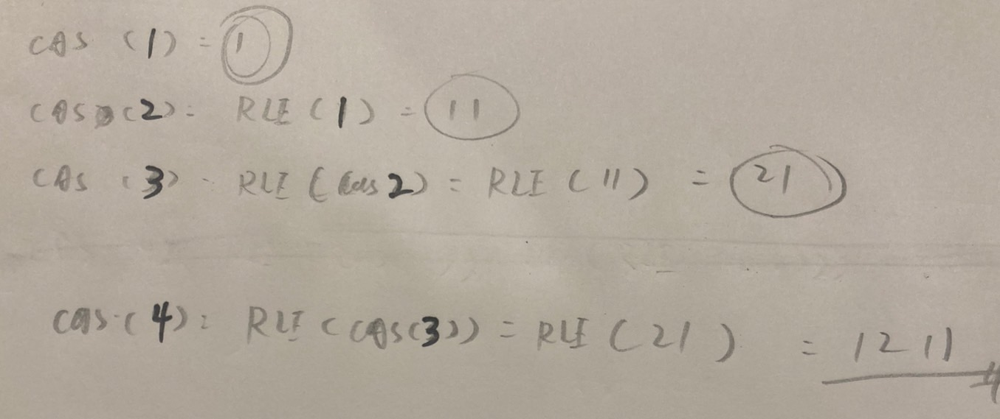

# Count and Say

<br>

---

<br>

## Desc


The count-and-say sequence is a sequence of digit strings defined by the recursive formula:

countAndSay(1) = "1"
countAndSay(n) is the run-length encoding of countAndSay(n - 1).
Run-length encoding (RLE) is a string compression method that works by replacing consecutive identical characters (repeated 2 or more times) with the concatenation of the character and the number marking the count of the characters (length of the run). For example, to compress the string "3322251" we replace "33" with "23", replace "222" with "32", replace "5" with "15" and replace "1" with "11". Thus the compressed string becomes "23321511".

Given a positive integer n, return the nth element of the count-and-say sequence.

<br>

Example 1:

```
Input: n = 4

Output: "1211"
```

<br>

Explanation:

countAndSay(1) = "1"
countAndSay(2) = RLE of "1" = "11"
countAndSay(3) = RLE of "11" = "21"
countAndSay(4) = RLE of "21" = "1211"

<br>

Example 2:

```
Input: n = 1

Output: "1"
```

Explanation:

This is the base case.

<br>


Constraints:

```
1 <= n <= 30
```

__Follow up: Could you solve it iteratively?__

<br>
<br>

## Topic

* Recursion
* String
* Iterator
* Dynamic Programming
* Two Pointers
* Stack
* Array
* Memoization
* Sliding Window
* Counting
* Greedy
* Simulation
* Backtracking
* Queue
* Depth-First Search
* Hash Table
* String Matching
* Math
* Sorting
* Monotonic Stack
* Brainteaser
* Enumeration

<br>
<br>


## Thinking

<br>

This is how I solve countAndSay(4) by manual:



definitely gonna try it out with dynamic programming first.

Let's having some fun with DP ~

<br>

