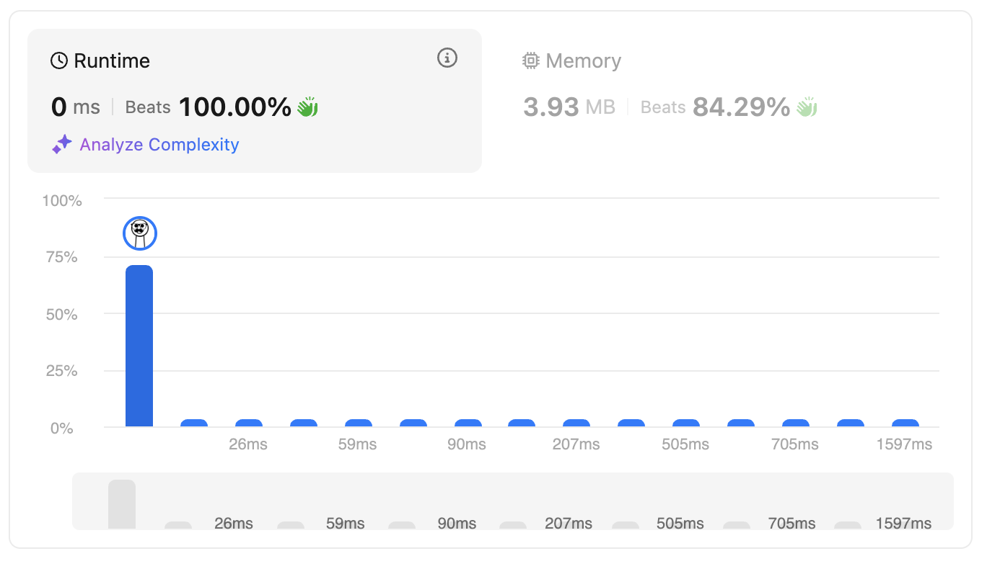

# 60. Permutation Sequence

<br>

---

<br>

link: https://leetcode.com/problems/permutation-sequence/description/

<br>

## Thinking

All the problems with permutation remind me about backtracking approach. As I remember what I did before,
maybe I can try using backtracking to collect all the results? and get `K`th to return.

<br>
<br>

## Claude AI suggestions:

### Issues with generating all permutations:

* Time complexity would be O(n! × n) since you'd generate all n! permutations
* Space complexity would be O(n!) to store them
* This would likely cause Time Limit Exceeded (TLE) for larger inputs

<br>

### Better approach: Mathematical solution

Instead of generating all permutations, you can directly construct the k-th permutation using the factorial number
system. Here's the key insight:
For n numbers, there are n! total permutations. These can be divided into n groups, where each group contains (n-1)!
permutations starting with the same first element.
Here's how to think about it:

* Convert k to 0-indexed (k = k-1)
* The first digit's position can be determined by k // (n-1)!
* Update k to k % (n-1)!
* Repeat for remaining positions

<br>
<br>

## Explain:

### Setup

For n=3, we have numbers [1, 2, 3] and there are 3! = 6 total permutations:

```
[1,2,3]
[1,3,2]
[2,1,3]  ← we want this one (k=3)
[2,3,1]
[3,1,2]
[3,2,1]
```

### The Key Insight

Notice how these 6 permutations are grouped:

```
Permutations 1-2 start with 1 (there are 2! = 2 of them)
Permutations 3-4 start with 2 (there are 2! = 2 of them)
Permutations 5-6 start with 3 (there are 2! = 2 of them)
```

Step-by-step for n=3, k=3

Initial state:

```
Available numbers: [1, 2, 3]
Result: []
k = 3
```

### Step 1: Convert k to 0-indexed

```
k = k - 1 = 3 - 1 = 2
(We do this because array indices start at 0, but k starts at 1)
```

### Step 2: Find the first digit

* How many permutations start with each digit? (n-1)! = 2! = 2
* Which group does k=2 fall into? k // (n-1)! = 2 // 2 = 1
* This means we want the element at index 1 in [1,2,3], which is 2

```
Result: [2]
Remove 2 from available: [1, 3]
Update k: k % (n-1)! = 2 % 2 = 0
```

### Step 3: Find the second digit

* Now we have 2 numbers left, so (n-1)! = 1! = 1
* Which position? k // 1! = 0 // 1 = 0
* This means we want the element at index 0 in [1,3], which is 1

```
Result: [2, 1]
Remove 1 from available: [3]
Update k: k % 1! = 0 % 1 = 0
```

### Step 4: Find the third digit

* Only one number left: 3

```
Result: [2, 1, 3]
```

## The "Why" Behind k % (n-1)!

Imagine you have 6 items numbered 0-5, arranged in 3 groups of 2:

```
Group 0: items 0, 1
Group 1: items 2, 3
Group 2: items 4, 5
```

If you want item 2:

```
2 // 2 = 1 tells you it's in Group 1
2 % 2 = 0 tells you it's the 0th item within Group 1
```

<br>
<br>

## Coding

```go
import (
	"strconv"
	"strings"
)

func getPermutation(n int, k int) string {
	used := make([]bool, n+1)
	result := &[]int{}

	// 1. convert k to k_idx:
	kIdx := k - 1

	collect(used, kIdx, n, result)

	var sb strings.Builder
	for _, v := range *result {
		sb.WriteString(strconv.Itoa(v))
	}
	return sb.String()
}

func collect(used []bool, kIdx int, n int, result *[]int) {
	if n == 0 {
		return
	}
	// 2. choose group
	eachGpCount := factorial(n - 1)
	targetGp := chooseGpIdx(kIdx, eachGpCount)

	// 3. put int into result.
	target := findIdx(used, targetGp)
	//fmt.Println("========================================")
	//fmt.Println("n:", n, "eachGpCount:", eachGpCount, "kIdx:", kIdx)
	//fmt.Println("used:", used, "targetGp:", targetGp)
	//fmt.Println("find target:", target)
	*result = append(*result, target)
	used[target] = true

	// 4. upgrade kIdx and n
	kIdx = upgradeKIdx(kIdx, eachGpCount)

	//fmt.Println("current result:", result)

	collect(used, kIdx, n-1, result)
}

func factorial(n int) int {
	accumulator := n
	for i := n - 1; i > 0; i-- {
		accumulator *= i
	}
	return accumulator
}

func chooseGpIdx(kIdx, eachGpCount int) int {
	if eachGpCount == 0 {
		return 0
	}
	// formula: gpIdx = kIdx / eachGpCount
	return kIdx / eachGpCount
}

func upgradeKIdx(kIdx, eachGpCount int) int {
	if eachGpCount == 0 {
		return 0
	}
	return kIdx % eachGpCount
}

func findIdx(used []bool, idx int) int {
	count := 0
	// used[0] is not include.
	for i := 1; i < len(used); i++ {
		if !used[i] {
			count++
			if idx == count-1 {
				return i
			}
		}
	}
	return -1
}
```

<br>

## Result

