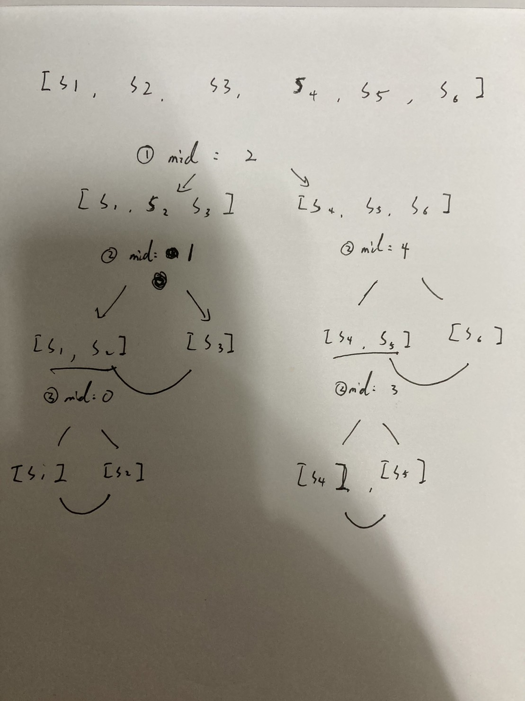

# Divide and conquer

 

---

 

using divide and conquer to solve LCP problem to me is like kinda familiar.
it's just like fork join.

split strs to 2 pair keep doing this unit split 2 str and compare the longest common prefix.

 

By now, I can't just take it as granted, kinda too hard to understand.
I'm just gonna do it again and again to remember it.