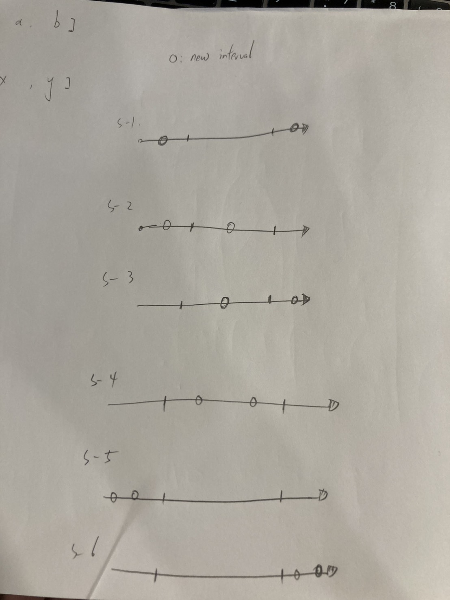

# Insert Interval

<br>

---

<br>

link: https://leetcode.com/problems/insert-interval/

<br>

## Thinking

<br>

I ain't got some good idea with it, I guess just iterate through all intervals and using temp storage to cache the
target interval. create new interval and insert into new array.
let's check it out.

we got 6 kind of situation:



<br>

We need handle all situations.

## Coding

<br>

```go
type situation = int8

const (
	BOTH_OUT situation = iota
	LEFT_OUT_RIGHT_IN
	LEFT_IN_RIGHT_OUT
	BOTH_IN
	BOTH_RIGHT
	BOTH_LEFT
)

func insert(intervals [][]int, newInterval []int) [][]int {
	// newInterval -> [4, 8]

	finalResult := [][]int{}

	if len(intervals) == 0 {
		finalResult = append(finalResult, newInterval)
		return finalResult
	}

	flag := true // flag means already dumped newInterval into final result.

	// [[1,2],[3,5],[6,7],[8,10],[12,16]]
	for _, interval := range intervals {

		sit, err := getSituation(newInterval, interval)
		if err != nil {
			panic(err)
		}
		fmt.Println("sit:", sit, "current new interval:", newInterval, "current interval:", interval, "current final:", finalResult)

		switch sit {
		case BOTH_OUT:
			// do nothing
			break
		case LEFT_OUT_RIGHT_IN:
			newInterval[1] = interval[1]
			break
		case LEFT_IN_RIGHT_OUT:
			newInterval[0] = interval[0]
			break
		case BOTH_IN:
			finalResult = append(finalResult, []int{interval[0], interval[1]})
			flag = false
			break
		case BOTH_RIGHT:
			finalResult = append(finalResult, []int{interval[0], interval[1]})
			break
		case BOTH_LEFT:
			if flag {
				finalResult = append(finalResult, []int{newInterval[0], newInterval[1]})
				flag = false
			}
			finalResult = append(finalResult, []int{interval[0], interval[1]})

			break
		}
	}

	if flag {
		finalResult = append(finalResult, newInterval)
	}

	return finalResult
}

func getSituation(newInterval []int, interval []int) (situation, error) {
	if newInterval[0] < interval[0] && newInterval[1] > interval[1] {
		return BOTH_OUT, nil
	}
	if newInterval[0] < interval[0] && (newInterval[1] >= interval[0] && newInterval[1] <= interval[1]) {
		return LEFT_OUT_RIGHT_IN, nil
	}
	if (newInterval[0] >= interval[0] && newInterval[0] <= interval[1]) && newInterval[1] > interval[1] {
		return LEFT_IN_RIGHT_OUT, nil
	}
	if newInterval[0] >= interval[0] && newInterval[1] <= interval[1] {
		return BOTH_IN, nil
	}
	if newInterval[1] < interval[0] {
		return BOTH_LEFT, nil
	}
	if newInterval[0] > interval[1] {
		return BOTH_RIGHT, nil
	}
	return 0, fmt.Errorf("unknown situation newInterval:%d, interval:%d", newInterval, interval)
}
```

I did it, but performance in not good:


<br>

let try revamp it!

<br>

## Revamp

First, I need to figure out what's the problem with my code. let's ask claude AI for advice:

<br>


### Claude AI advice:

>Looking at your solution, you're definitely on the right track with categorizing different overlap situations! Your approach of handling different cases is logical, but there are some issues causing incorrect behavior and poor performance. 

### Issues with Current Solution

1. Logic Error in BOTH_IN case: When newInterval is completely inside an existing interval, you're adding the existing interval and setting flag = false. This means you'll never add the newInterval to the result, which is incorrect. The newInterval should replace or merge with the existing interval.
2. Mutation of newInterval: You're modifying newInterval in-place during the loop, which affects subsequent comparisons. This can lead to incorrect merging.
3. Complex State Management: The flag variable and the way you're handling when to insert newInterval makes the logic harder to follow and more error-prone.

### Better Approach to Think About This Problem

Instead of categorizing into 6 situations, think of it more simply with 3 key observations:


1. No Overlap - Current interval comes before newInterval: Add current interval to result
2. No Overlap - Current interval comes after newInterval: Add newInterval first (if not already added), then current interval
3. Overlap exists: Merge the intervals by expanding newInterval's boundaries

Here's the cleaner mental model:

```
For each interval:
- If it ends before newInterval starts → add it to result (no overlap, comes before)
- If it starts after newInterval ends → add newInterval first if needed, then add current (no overlap, comes after)  
- Otherwise → merge by expanding newInterval boundaries (overlap exists)
```

### How to Fix Your Approach

If you want to keep your situation-based approach, here's what needs fixing:

Don't mutate newInterval directly - create a merged interval variable
Simplify your situations - you really only need 3 cases: before, after, and overlapping
Track whether you're still merging - once you find non-overlapping intervals after the newInterval, you know merging is done

<br>

## Final Code

```go
func insert(intervals [][]int, newInterval []int) [][]int {

	finalResult := [][]int{}
	if len(intervals) == 0 {
		return append(finalResult, newInterval)
	}

	mergedInterval := []int{newInterval[0], newInterval[1]}
	flag := true

	for _, interval := range intervals {
		if mergedInterval[0] > interval[1] { // situation-1: No-Overlapping (new interval both right)
			finalResult = append(finalResult, interval)
		} else if mergedInterval[1] < interval[0] { // situation-2: No-Overlapping (new interval both left)
			if flag {
				flag = false
				finalResult = append(finalResult, mergedInterval)
			}
			finalResult = append(finalResult, interval)
		} else { // situation-3: Overlapping (do merge)
			// Merge the intervals by expanding newInterval's boundaries
			mergedInterval[0] = min(interval[0], mergedInterval[0])
			mergedInterval[1] = max(interval[1], mergedInterval[1])
		}
	}

	if flag {
		finalResult = append(finalResult, mergedInterval)
	}

	return finalResult
}
```

Result:

