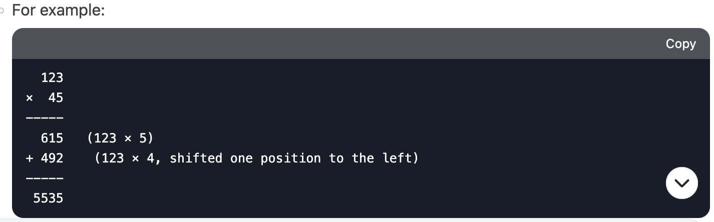

# 043. Multiply Strings (Revamp with DeepSeek)

<br>

---

<br>

I asked DeepSeek how to analyze this problem, and make the code structure.

<br>
<br>

## DeepSeek answer:

<br>

1. Multiplication by Hand:

When multiplying two numbers manually, you multiply each digit of the second number (num2) with each digit of the first number (num1),
and then sum the results with appropriate shifts (based on the position of the digits).

<br>



<br>

2. Result Length:

The maximum length of the result will be len(num1) + len(num2). For example, 99 × 99 = 9801 (2 digits × 2 digits = 4 digits).

<br>

3. Digit-by-Digit Multiplication:

* Each digit in num1 and num2 is a character, so you need to convert it to its integer value (e.g., '5' → 5).

* Use a result array to store intermediate products and handle carry-over.

<br>

4. Carry Handling:

After multiplying two digits, the result might be a two-digit number. The tens place is carried over to the next position.


<br>

### Plan the Code Structure


1. Initialize the Result Array:

Create an array result of size len(num1) + len(num2) to store the product.

2. Multiply Digits:

* Iterate through each digit of num1 (from right to left).

* For each digit in num1, iterate through each digit of num2 (from right to left).

* Multiply the two digits and add the result to the appropriate position in the result array.

3. Handle Carry:

After each multiplication, update the carry and store the result in the correct position.

4. Convert Result to String:

Convert the result array to a string, removing any leading zeros.

<br>
<br>

## Pseudocode

```plaintext
function multiplyStrings(num1, num2):
    if num1 == "0" or num2 == "0":
        return "0"

    m = length of num1
    n = length of num2
    result = array of size (m + n) initialized with 0

    for i from m-1 to 0:
        for j from n-1 to 0:
            product = (num1[i] - '0') * (num2[j] - '0')
            sum = product + result[i + j + 1]
            result[i + j + 1] = sum % 10
            result[i + j] += sum // 10

    remove leading zeros from result
    return result as a string
```

