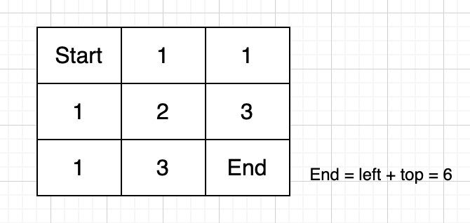
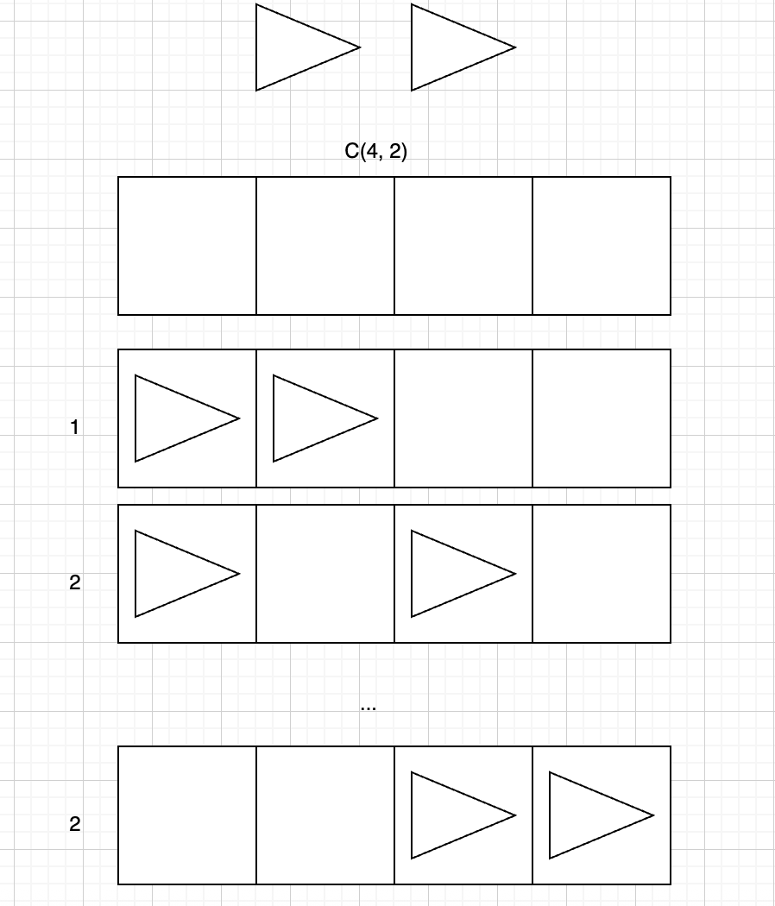

# 62. Unique Paths

<br>

---

<br>

link: https://leetcode.com/problems/unique-paths/description/

<br>

## Hints & Approaches

I know I'm not good at DP problem, I need ask for some advice.

<br>

### Key Insights:

- You can only move **right** or **down**
- Think about it step by step: How many ways can you reach any given cell?
- The answer for any cell depends on the cells you can come from

### Approach 1: 2D Dynamic Programming

- Create a 2D grid dp[i][j] representing number of ways to reach position (i,j)
- Base cases: What about the first row and first column?
- Recurrence relation: dp[i][j] = ?

### Approach 2: Mathematical Solution

- Think about this problem differently: You need exactly (m-1) right moves and (n-1) down moves
- Total moves = (m-1) + (n-1) = m+n-2
- This becomes a combinatorics problem: Choose (m-1) positions out of (m+n-2) total moves
- Formula: C(m+n-2, m-1) = C(m+n-2, n-1)

### Approach 3: Space Optimized DP

- Do you really need a 2D array?
- Can you solve it with just 1D array by processing row by row?

### Questions to Ask Yourself:

1. What are the base cases (first row, first column)?
2. If I'm at position (i,j), where could I have come from?
3. How can I optimize space complexity?

<br>
<br>

## Thinking

Now I have some idea about using a 2D array (DP). The value of `dp[i][j]` represent how much way to reach this position.

For example: m = 3, n = 3



Every position's transform function is `top + right`

<br>

First of all, just init the start point `dp[0][0]` as 1 then iterate all the position and calculate the num with
transform func until the end position.
Let try it out.

## Coding - 2D array (DP Approach)

```go
func uniquePaths(m int, n int) int {
	// init 2D array (DP)
	dp := make([][]int, m)

	for row := range dp {
		dp[row] = make([]int, n)
	}

	// init start position:
	dp[0][0] = 1

	for row := range dp {
		for column := range dp[row] {
			leftVal := 0
			if column-1 >= 0 {
				leftVal = dp[row][column-1]
			}

			topVal := 0
			if row-1 >= 0 {
				topVal = dp[row-1][column]
			}

			dp[row][column] += leftVal + topVal
		}
	}

	return dp[m-1][n-1]
}
```

<br>

## 2D array (DP Approach) Summary

Since I figure out how to define the DP array, all the riddle are cleared.
The critical point about DP problems is just define DP Array. 

I think each position in 2D array is the value of final result, every position could be the result.

<br>
<br>

## Coding - 1D array (Space Optimized DP)

Critical Point: processing row by row.

I think it's just could be the same just like 2D array, the different part is we don't need cell.

Ex: m = 3, n = 3

* first we can get first row like: `[1, 1, 1]`
* now we can iterate though the row to calculate second row:
  * each element equals to dp[i] + dp[i-1], and we can get second row like :`[1, 2, 3]`
  * the last row do the same thing: `[1, 3, 6]`

Let try it out:

```go
func uniquePaths(m int, n int) int {
	// init 1D array (DP) using column as length
	dp := make([]int, n)
	dp[0] = 1

	for range m {
		for i := range dp {
			if i == 0 {
				// first col never change (always = 1)
				continue
			}

			dp[i] += dp[i-1]
		}
	}

	return dp[n-1]
}
```

<br>
<br>

## Coding Mathematical Solution

<br>

Same Example: m = 3, n = 3

We Know we need to move 2 times Right, 2 times Down. it becomes a combinatorics
we have total 4 steps, and we need to count how many combination can be (4 steps choose 2 Right or 2 Down).

`C(4, 2)`


<br>

```go
func uniquePaths(m int, n int) int {
	totalSteps := m - 1 + n - 1
	return c(totalSteps, m-1)
}

func c(n int, k int) int {
	// C(n,k) = n! / (k! × (n-k)!)
	// 利用對稱性：C(n,k) = C(n,n-k)
	if k > n-k {
		k = n - k
	}

	result := 1
	for i := 0; i < k; i++ {
		result = result * (n - i) / (i + 1)
	}
	return result
}
```