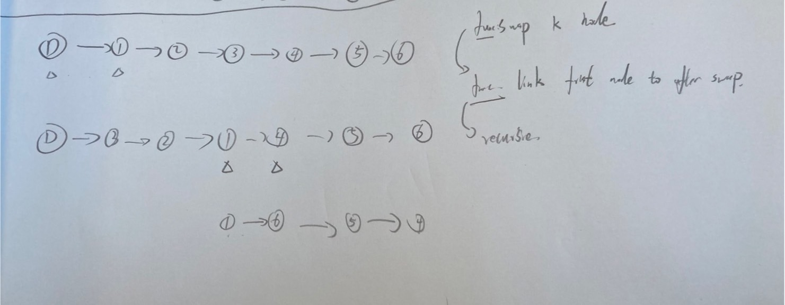
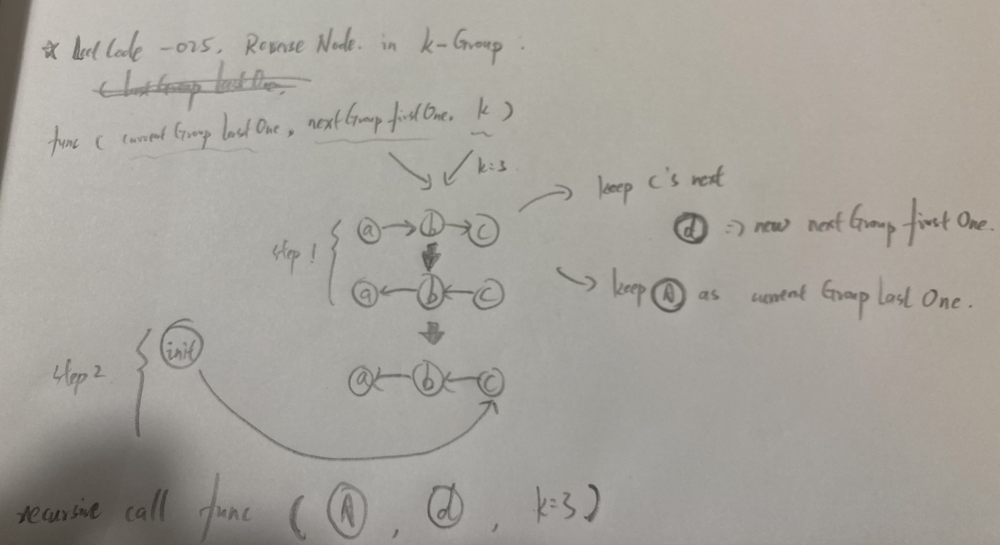

# Reverse Nodes in k-Group

<br>

---

<br>

## Desc

Given the head of a linked list, reverse the nodes of the list k at a time, and return the modified list.

k is a positive integer and is less than or equal to the length of the linked list. If the number of nodes is not a multiple of k then left-out nodes, in the end, should remain as it is.

You may not alter the values in the list's nodes, only nodes themselves may be changed.

<br>

Example 1:


```
Input: head = [1,2,3,4,5], k = 2
Output: [2,1,4,3,5]
```

<br>

Example 2:


```
Input: head = [1,2,3,4,5], k = 3
Output: [3,2,1,4,5]
```

<br>

Constraints:
```
The number of nodes in the list is n.
1 <= k <= n <= 5000
0 <= Node.val <= 1000
```

<br>

Follow-up: Can you solve the problem in O(1) extra memory space?

<br>
<br>

## Topic

* Linked List
* Recursion

<br>

## Thinking



* init a dummy head node, link to head input.
* input to recursive func with dummy node.
* implements a swap k node func like input `1-2-3` swap `3-2-1`
* swap dummy's next with k, linked dummy's next to new sorted link head
* linked new sort linked last node to next step's head
* recursive call.

<br>

Further more brain storm:




<br>

## Final

```go
package main

type ListNode struct {
    Val  int
    Next *ListNode
}

func reverseKGroup(head *ListNode, k int) *ListNode {
	dummy := &ListNode{}
	recursion(dummy, head, k)
	return dummy.Next
}

// assume there are 3 nodes: A, B, C.
func recursion(lastGroupLastOne, currentGroupFirstOne *ListNode, k int) {
	// 1. find Node C:
	nodeC := currentGroupFirstOne
	for i := range k {
		if nodeC == nil {
			lastGroupLastOne.Next = currentGroupFirstOne
			return
		}
		if i < k-1 {
			nodeC = nodeC.Next
		}
	}

	// 2. keep C's next as D
	nodeD := nodeC.Next

	// 3. keep A for next recursion call `lastGroupLastOne`
	nodeA := currentGroupFirstOne

	// 4. reverse K Nodes "A->B->C" => "A<-B<-C"
	reverseKNode(currentGroupFirstOne, currentGroupFirstOne.Next, k-1)

	// 5. link last group last one to nodeC
	lastGroupLastOne.Next = nodeC

	// 6. recursion call
	recursion(nodeA, nodeD, k)

}

func reverseKNode(first, second *ListNode, k int) {
	if k == 0 {
		return
	}
	third := second.Next
	second.Next = first
	reverseKNode(second, third, k-1)

}
```

