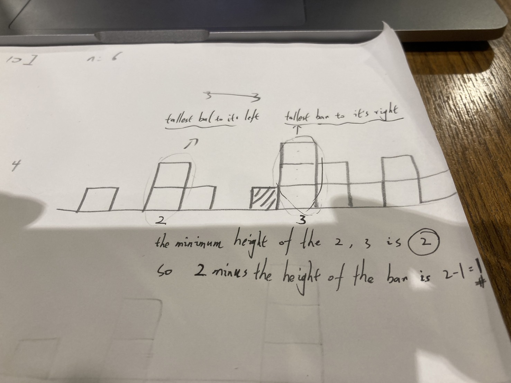
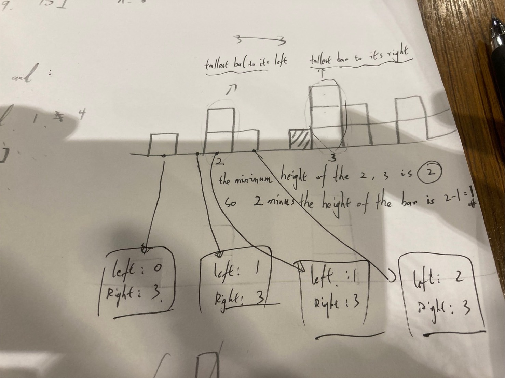

# Trapping Rain Water

<br>

----

<br>

## Desc

Given n non-negative integers representing an elevation map where the width of each bar is 1, 

compute how much water it can trap after raining.

<br>

Example 1:


```
Input: height = [0,1,0,2,1,0,1,3,2,1,2,1]
Output: 6
```

Explanation: The above elevation map (black section) is represented by array [0,1,0,2,1,0,1,3,2,1,2,1]. In this case, 6 units of rain water (blue section) are being trapped.

<br>

Example 2:

```
Input: height = [4,2,0,3,2,5]
Output: 9
```

<br>


Constraints:

```
n == height.length
1 <= n <= 2 * 104
0 <= height[i] <= 105
```

<br>

## Topic

<br>

* Array
* Two Pointers
* Dynamic Programming
* Stack
* Monotonic Stack [Link-1](https://www.bilibili.com/video/BV1eA411M7Xt/?spm_id_from=333.337.search-card.all.click)
    [Link-2](https://medium.com/%E6%8A%80%E8%A1%93%E7%AD%86%E8%A8%98/%E6%BC%94%E7%AE%97%E6%B3%95%E7%AD%86%E8%A8%98%E7%B3%BB%E5%88%97-monotonic-stack-queue-5ad1c35a3dfe)

<br>

## Thinking

I can only think about using 2 pointers to solve this problem.

### 2 Pointers:

* PointerA point at the first non-zero position, pointerB move to next position that is equals or higher than the number pointerA point at.
* Calculate the volume between pointerA and pointerB.
* Moving Pointer A to PointerB's position and do it again unit pointerB reached the end of the array.

<br>

### 2025/01/18: 

Actually It's not that easy like what I said above.
I brainstorm like 1~2 hour and still have no clue.

Let's ask chat-gpt for a hint:

### Chat-GPT hint:

To solve "Trapping Rain Water," start by considering these hints:

1. Key Insight: The amount of water trapped above a bar is determined by the minimum height of the tallest bars to its left and right, minus the height of the bar itself.

2. Approaches to Explore:

* Brute Force: Iterate through each bar, calculate the tallest bar on its left and right, and compute the water trapped. This is straightforward but not optimal.
 
* Dynamic Programming: Precompute arrays for the tallest bar to the left (leftMax) and the tallest bar to the right (rightMax) for every position. Use these arrays to calculate the water trapped efficiently.
 
* Two-Pointer Technique: Use two pointers, one starting at the left end and the other at the right end. Keep track of the maximum height encountered from each side and calculate trapped water as you converge.

* Consider Edge Cases: Handle scenarios with no bars or insufficient bars to trap water.

<br>

Choose one of these methods based on the balance of clarity and efficiency you're aiming for. Let me know if you'd like further elaboration on any of these approaches!

<br>

Now I understand the Key Insight. 

I drew a picture:



If I want to know how many water will be trapped above a bar. using 2 pointers spreading to both sides.
find tallest bar on both side. 

I find tallest bar on each side, as shown where I drew the circles.

A left bar with height of 2, a right bar with height of 3.

so  `(3-2) - 1 = 1` is the amount of water that will be trapped above a bar.

<br>

Alright! let's gear it up.

1. First of all, using Dynamic Programming (DP) to calculate tallest bar on each sides for every position.
   

2. calculate the result by using DP results.

<br>

```golang

type BarInfo struct {
	tallestLeftBarHeight  int
	tallestRightBarHeight int
	targetBarHeight       int
}

func trap(inputs []int) int {
	result := 0
	allPositionBarInfos := make([]BarInfo, 0)

	// Init first position
	allPositionBarInfos = append(allPositionBarInfos, initFirstBar(inputs))

	for i := 1; i < len(inputs); i++ {
		currentBar := BarInfo{}
		currentBar.targetBarHeight = inputs[i]
		previousBar := allPositionBarInfos[i-1]
		currentBar.tallestLeftBarHeight = max(previousBar.tallestLeftBarHeight, previousBar.targetBarHeight)
		currentBar.tallestRightBarHeight = max(previousBar.tallestRightBarHeight, currentBar.targetBarHeight)

		if currentBar.tallestRightBarHeight == currentBar.targetBarHeight {
			tallestRight := findTallestRight(inputs, i+1)
			currentBar.tallestRightBarHeight = tallestRight
		}

		allPositionBarInfos = append(allPositionBarInfos, currentBar)

		smallestSideBar := min(currentBar.tallestLeftBarHeight, currentBar.tallestRightBarHeight)
		waiter := smallestSideBar - currentBar.targetBarHeight
		if waiter > 0 {
			result += waiter
		}

	}

	return result
}

func findTallestRight(inputs []int, idx int) int {
	maxNum := 0
	for i := idx; i < len(inputs); i++ {
		maxNum = max(maxNum, inputs[i])
	}
	return maxNum
}

func initFirstBar(inputs []int) BarInfo {
	firstBar := BarInfo{}
	firstBar.targetBarHeight = inputs[0]
	firstBar.tallestLeftBarHeight = 0

	for i := 1; i < len(inputs); i++ {
		if inputs[i] > firstBar.tallestRightBarHeight {
			firstBar.tallestRightBarHeight = inputs[i]
		}
	}

	return firstBar
}
```


<br>

I passed test case, but it costs a huge runtime, about 307ms and memory 9.88MB also.

Let's revamp it next week.
