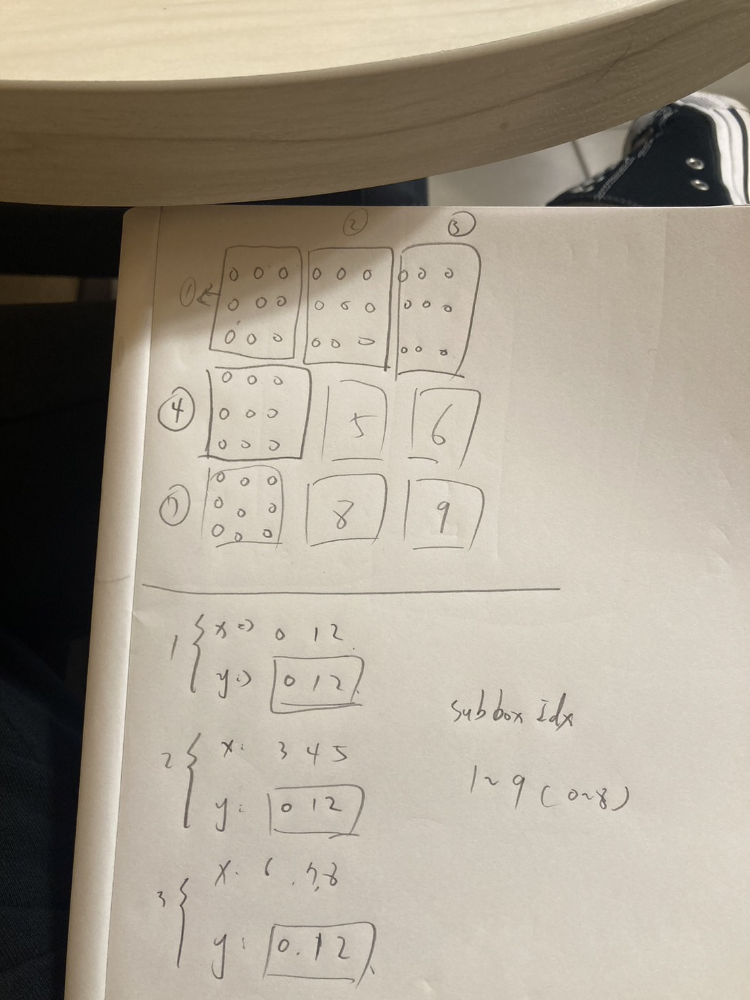
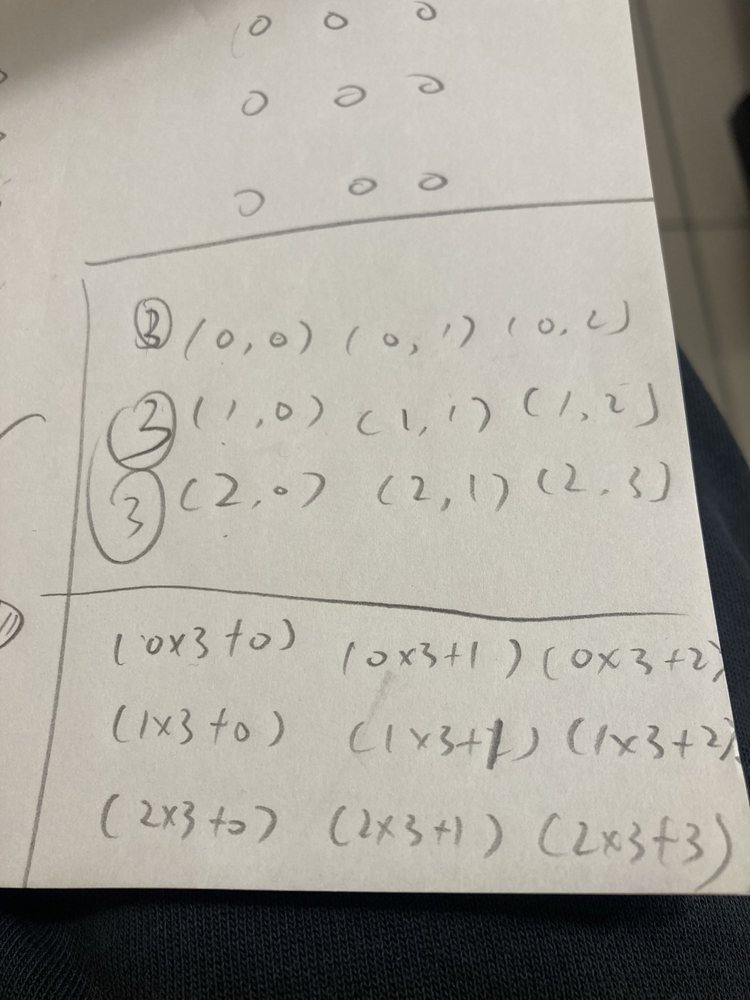

# Valid Sudoku

<br>

---

<br>

## Desc

Determine if a 9 x 9 Sudoku board is valid. Only the filled cells need to be validated according to the following rules:

Each row must contain the digits 1-9 without repetition.
Each column must contain the digits 1-9 without repetition.
Each of the nine 3 x 3 sub-boxes of the grid must contain the digits 1-9 without repetition.
Note:

A Sudoku board (partially filled) could be valid but is not necessarily solvable.
Only the filled cells need to be validated according to the mentioned rules.


<br>

Example 1:

```
Input: board =
[["5","3",".",".","7",".",".",".","."]
,["6",".",".","1","9","5",".",".","."]
,[".","9","8",".",".",".",".","6","."]
,["8",".",".",".","6",".",".",".","3"]
,["4",".",".","8",".","3",".",".","1"]
,["7",".",".",".","2",".",".",".","6"]
,[".","6",".",".",".",".","2","8","."]
,[".",".",".","4","1","9",".",".","5"]
,[".",".",".",".","8",".",".","7","9"]]
Output: true

```


Example 2:


```
Input: board =
[["8","3",".",".","7",".",".",".","."]
,["6",".",".","1","9","5",".",".","."]
,[".","9","8",".",".",".",".","6","."]
,["8",".",".",".","6",".",".",".","3"]
,["4",".",".","8",".","3",".",".","1"]
,["7",".",".",".","2",".",".",".","6"]
,[".","6",".",".",".",".","2","8","."]
,[".",".",".","4","1","9",".",".","5"]
,[".",".",".",".","8",".",".","7","9"]]
Output: false

```

Explanation: Same as Example 1, except with the 5 in the top left corner being modified to 8. Since there are two 8's in the top left 3x3 sub-box, it is invalid.

<br>

Constraints:

```
board.length == 9
board[i].length == 9
board[i][j] is a digit 1-9 or '.'.
```

<br>

## Topic

* Array
* Hash Table
* Matrix

<br>

## Thinking

First, I want check all the rows and columns (a total of 18 iterations).
I initialize a HashMap when checking each row or column, where the keys are "0" to "9," and the values represent the count of each number's occurrences.
After counting all elements in a row or column, I check the map. If any value in the map is greater than 1, I return false.

After finishing the row and column checks, I use the same approach to check all of the 3x3 sub-box matrices.

<br>

## Chat-GPT advice:

Yes, your approach is on the right track! Validating Sudoku by checking each row, column, and 3x3 sub-box is a good approach. Here’s a breakdown of why your method works and a couple of suggestions to refine it:

1. Row and Column Checks: Initializing a HashMap (or even a set) for each row and column check is effective for counting occurrences. By iterating through each cell, you can detect duplicates right away if any value appears more than once.

2. 3x3 Sub-box Checks: Reapplying the same logic for each 3x3 sub-box ensures thorough validation, covering the entire grid.

### Suggested Optimizations

* Use a Set Instead of a Map: If you only need to check for duplicates, a Set can be slightly more efficient than a HashMap since it will only store unique values. If you try to add a duplicate, the Set will reject it, making it straightforward to detect a problem.

* Combined Loops: If you’re open to combining all checks in one pass, you could track rows, columns, and sub-boxes simultaneously. This might save a bit of time, though it could make the code slightly more complex.

Overall, your approach is solid, and with these small adjustments, it can be even more efficient. Great work!

<br>

[Guide](https://skyyen999.gitbooks.io/-leetcode-with-javascript/content/questions/36md.html)

<br>

Create: 

* 9 cells number occurrences set
* 9 rows sets number occurrences set
* 9 3x3 sub-box sets number occurrences set

```
cellSet = [][]
rowSet = [][]
subBoxSet = [][]
```

<br>

subBox index:



<br>

I need a func to calculate subbox index:



```go
func calculateSubBoxIdx(x, y int) int {
    // Minimize x, y
    x = x / 3
    y = y / 3
    // calculate seq num
    return x*3 + y
}
```


